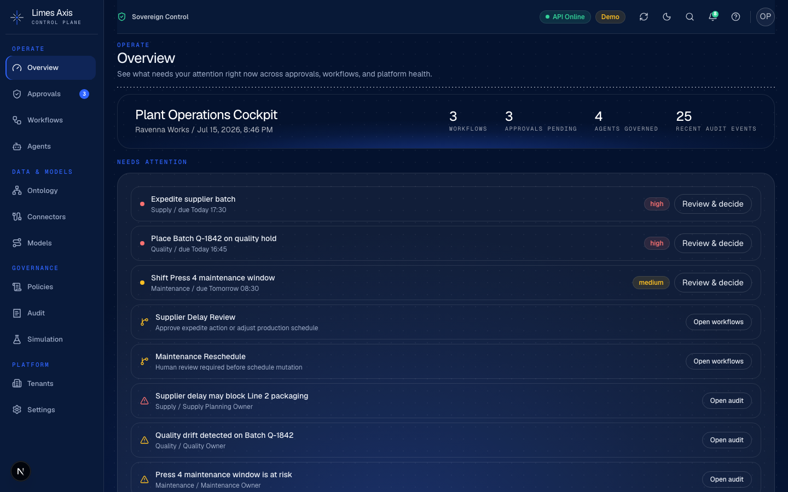
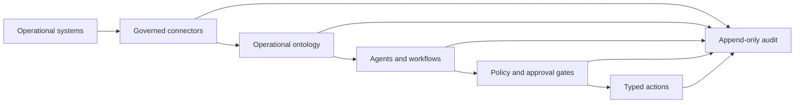
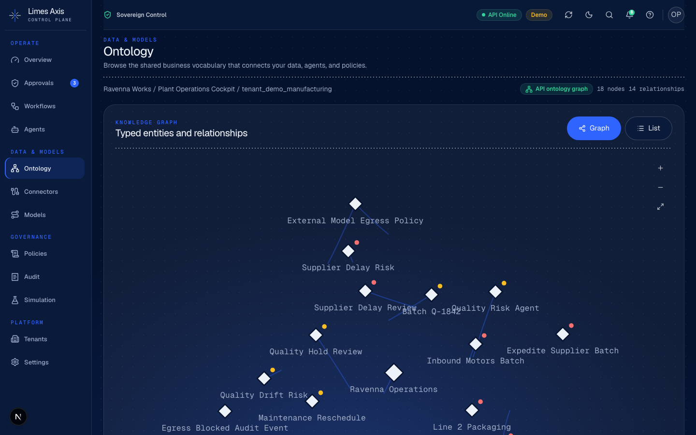
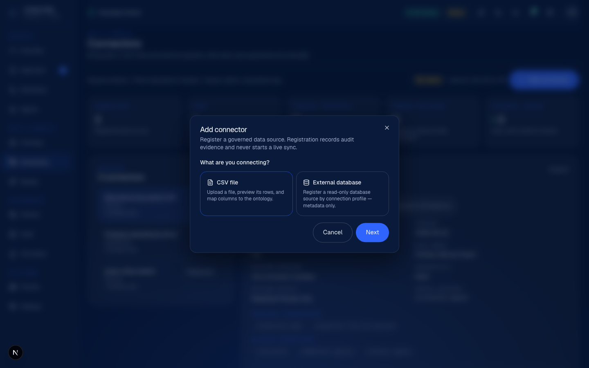

# Limes Axis

**The sovereign AI control plane for European operations.**

[](https://github.com/Limes-Labs/limes-axis/actions/workflows/ci.yml)
[](./LICENSE)
[](./docs/deployment.md)

Limes Axis connects operational data, humans, workflows and AI agents through
one governed control plane. Every meaningful read, proposal, approval and
action passes through typed contracts, explicit permissions and an append-only
audit trail.



## Why Axis

Enterprise AI becomes useful when it can participate in real operations. It
also becomes risky: context is fragmented, permissions are inconsistent and
agent actions are difficult to inspect after the fact.

Axis adds a governance layer above existing ERP, CRM, MES, databases,
documents and internal tools. It does not replace those systems of record and
it is not a chatbot framework.

- **Connect** governed sources without storing raw credentials in application records.
- **Model** operational context as a typed, permission-aware ontology.
- **Coordinate** durable workflows across people, services and AI agents.
- **Control** risky actions with policy checks and human approval gates.
- **Prove** what happened through tenant-scoped, append-only audit evidence.
- **Deploy** locally, in private cloud or on Kubernetes without a required managed service.

## How it fits together



The open core is built with Next.js and React, FastAPI, Postgres, TypeDB and
Temporal OSS. OIDC identity, relationship-aware authorization, OpenTelemetry
and object-storage boundaries are first-class parts of the architecture.

## Product surfaces

| Surface | What it provides |
| --- | --- |
| Control room | Action-first view of approvals, workflows, agents and platform health |
| Ontology | Typed entities, relationships, source links and permission scopes |
| Connectors | Governed manifests, previews, credentials, checkpoints and promotions |
| Approvals | Evidence-rich decisions with workflow and audit linkage |
| Agents and actions | Autonomy ceilings, typed schemas, policy evaluation and dry-run/propose modes |
| Audit and simulation | Persisted evidence, export integrity and deterministic replay |
| Platform | Tenant lifecycle, quotas, usage metering, identity and deployment readiness |

<table>
  <tr>
    <td width="50%">
      
    </td>
    <td width="50%">
      
    </td>
  </tr>
  <tr>
    <td align="center"><strong>Permission-aware operational graph</strong></td>
    <td align="center"><strong>Governed connector onboarding</strong></td>
  </tr>
</table>

## Current status

Axis is an evaluation and hardening platform, not a production certification.
The manufacturing reference scenario is the first complete demonstration of
the platform; the architecture is vertical-agnostic.

| Area | Status | Boundary |
| --- | --- | --- |
| API, console and persisted demo | Available | API-backed, tenant-scoped reference environment |
| Ontology, approvals, workflows and audit | Available | Read paths and governed mutation boundaries are tested |
| Connector and model execution | Flag-gated | Disabled by default; external egress remains separately controlled |
| OIDC, tenancy and deployment profiles | Available for evaluation | Readiness reports are evidence, not certification |
| Search, Assistant, Scenarios and vertical packs | Planned | Tracked in the Operate milestone |
| Production validation and external security review | Not complete | Explicitly remains roadmap work |

Execution features fail closed. In particular, model routing requires both
`AXIS_MODEL_ROUTING_EXECUTION_ENABLED=true` and an exact operator allowlist in
`AXIS_MODEL_INVOCATION_ALLOWED_BASE_URLS`; external model egress has its own
independent gate.

See the [public roadmap](./plan.md) and the detailed
[Operate milestone plan](./docs/plans/2026-07-11-operate-milestone.md).

## Quick start

Prerequisites: Docker Desktop, Python 3.12 with
[uv](https://docs.astral.sh/uv/), Node.js and pnpm.

```bash
cp .env.example .env
make install
make dev-stack-up
make demo-db-upgrade
```

Start the API:

```bash
make demo-api
```

In another terminal, start the console:

```bash
make demo-web
```

Open [http://127.0.0.1:3000](http://127.0.0.1:3000). The local stack also
includes Postgres, TypeDB, Temporal, MinIO and Keycloak. Use
`make dev-stack-down` when finished.

For a repeatable evaluation flow, follow
[Demo readiness](./docs/demo-readiness.md). It includes bootstrap, live route,
CORS and browser checks; a passing `/health` response alone is not considered
a restored demo.

## Development

Run the main verification matrix:

```bash
make lint
make typecheck
make test
make build-web
make openapi-check
make demo-check
make security-check
make deployment-check
```

Optional integration and browser checks require the local runtime:

```bash
make test-integration
pnpm --filter @limes-axis/web test:e2e
pnpm --filter @limes-axis/web test:e2e:live
```

Container release and vulnerability workflows cover the API, web console and
worker images. Local critical-vulnerability reports are produced under
`.axis/trivy-reports/` by `make container-scan-local`. Run
`make container-check` to validate the image build contract, then
`make container-release-check` to verify the keyless signing, SBOM and
provenance contract; run `make container-security-check` and
`make vulnerability-management-check` to verify the Trivy/SARIF policy and
expiring vulnerability exceptions.

## Documentation

- [Architecture](./docs/architecture.md)
- [Demo readiness](./docs/demo-readiness.md)
- [Deployment](./docs/deployment.md)
- [Approval delivery outbox](./docs/approval-decision-outbox.md)
- [Security review checklist](./docs/security-review-checklist.md)
- [Threat model](./docs/threat-model.md)
- [Platform overview](./docs/platform-overview.md)
- [Connectors](./docs/platform-connectors.md)
- [Model routing](./docs/platform-model-routing.md)
- [Observability](./docs/platform-observability.md)
- [Python SDK](./docs/sdk-python.md)
- [Support and operations](./docs/support-operations.md)

The generated REST contract is available at [docs/openapi.json](./docs/openapi.json).

## Repository map

```text
apps/web/             Next.js governance console
services/api/         FastAPI control plane and persistence
services/worker/      Temporal workflows, schedules and activities
packages/schemas/     Published JSON Schema contracts
packages/sdk-python/  Typed sync and async Python client
infra/docker/         Local self-hosted runtime
infra/helm/           Kubernetes evaluation profiles
docs/                 Architecture, product, security and operations guides
```

## Contributing

Contributions should preserve the project invariants: tenant isolation,
fail-closed permissions, typed actions, no secret material in evidence, and
honest capability claims. Read [CONTRIBUTING.md](./CONTRIBUTING.md) and
[SECURITY.md](./SECURITY.md) before opening a change.

## License

Apache License 2.0. See [LICENSE](./LICENSE).
