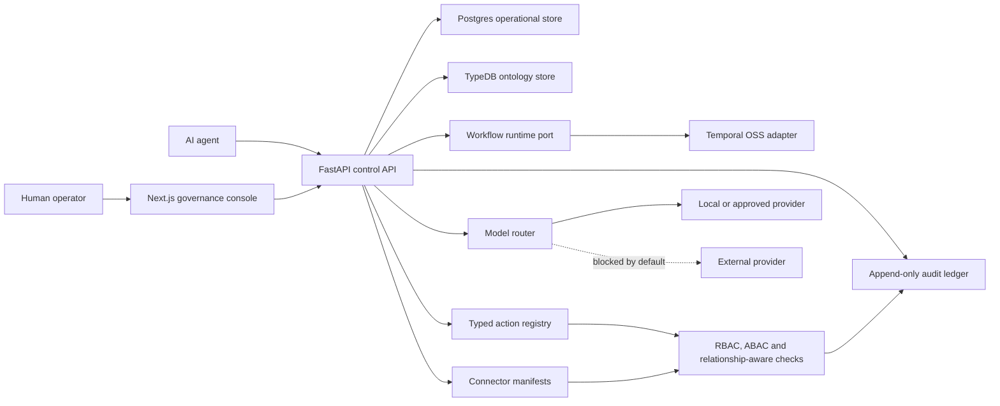

# Limes Axis Architecture

Limes Axis is the sovereign AI control plane for European operations. The open
core is designed to be self-hostable, auditable and extractable into separate
modules or repositories when Cloud, Enterprise, connectors, SDK, deployment or
docs grow beyond the product repo.

## System Shape

## Foundation Modules

- `apps/web`: Next.js governance console shell.
- `services/api`: FastAPI control API, config, errors, tenancy, permissions,
  model routing, action registry, audit models, Alembic migrations and TypeDB
  ontology boundary.
- `services/worker`: workflow runtime port and Temporal adapter.
- `packages/schemas`: shared public schemas.
- `infra/docker`: self-hosted local runtime for Postgres, TypeDB, Temporal,
  MinIO and Keycloak.

## Data Boundaries

Postgres owns operational records that need transactional semantics: tenants,
actors, approval records, action runs and append-only audit events. TypeDB owns
the operational ontology: actors, organizations, assets, processes, workflows,
operations, policies, approvals, audit evidence and relationship primitives.
Ontology graph reads go through an Axis query runtime boundary. The deferred
runtime serves the public manufacturing seed; the TypeDB query runtime can be
enabled separately from graph mutations and keeps TypeQL execution, response
mapping and relationship-scope filtering behind the same contract.

Search starts from Postgres and remains behind an adapter until a specialized
engine is justified.

## Runtime Boundaries

Temporal is the first workflow engine, but application code depends on an Axis
workflow runtime port. This keeps orchestration replaceable and makes future
Cloud, Enterprise and deployment extraction cleaner.

The model router is provider-agnostic. External provider egress is blocked by
default and must be explicitly enabled by policy. The current public Platform
slice exposes read-only model route telemetry and synthetic cost estimates; live
provider adapters, persisted usage records, budget enforcement and
OpenTelemetry-emitted route spans remain behind the runtime boundary.

Connector manifests sit behind an Axis connector runtime boundary. The current
public Platform slice exposes a preview-only file/CSV manufacturing connector
that validates rows and a metadata-only external DB connector that previews
declared table metadata through profile ids and credential handles. Both map
public-safe input to ontology proposals and return redacted audit preview
metadata without persisting raw file content, storing credentials, executing
SQL, calling external systems or mutating the graph. Tenant-scoped connector
manifest records can be registered with `connector.manifest.registered` audit
evidence before scheduled sync exists; registration rejects raw connection
fields, SQL/query text and credential material and does not activate runtime
execution. Tenant-scoped connector configuration records are persisted
separately from connector runs and reject raw credential fields. Credential
handle records persist external secret
references, rotation metadata and rotation history without storing raw
credential values. Credential lease records add a Vault/KMS lease boundary with
request, renew and revoke audit evidence, permission decisions and deferred
adapter results while never returning secret material. Connector run records
persist redacted input/result summaries and link to append-only
`connector.run.recorded` audit events. Governed dry-run
connector execution now calls a deferred Axis connector execution adapter,
requires credential handle ids and writes `connector.run.execution_deferred`
evidence while keeping `external_sync_started=false`. Connector ontology
proposal records persist preview-derived proposed nodes for review, link to
`connector.ontology_proposals.recorded` audit events and keep graph mutation
explicitly `not_applied`. Manual import request records
capture approval ids, workflow ids and idempotency keys for future proposal
promotion, link to `connector.manual_import.requested` audit events and still
keep graph mutation explicitly `not_applied`. Manual import decisions require
the connector approval scope, record approval outcome metadata, signal the Axis
workflow runtime with `connector_manual_import_decided`, link to
`connector.manual_import.decision_recorded` audit events and still avoid
connector execution. Controlled ontology promotions require approved manual
import evidence, workflow signal evidence, `connectors:ontology:promote`,
idempotency and append-only `connector.ontology_promotion.*` audit writes before
calling the Axis TypeDB mutation adapter. Promotion policies add a separate
authoring and enforcement boundary with `connectors:promotion_policy:author`,
required promotion scope metadata and `connector.promotion_policy.authored`
audit evidence. Enabling a policy is a separate approval/workflow-gated
transition requiring `connectors:promotion_policy:enable` and writing
`connector.promotion_policy.enabled`; enabled required policies are
auto-selected when omitted from the promotion request and checked before TypeDB
mutation execution. Versioned policy sets add
`connectors:promotion_policy_set:activate` and
`connector.promotion_policy_set.activated` evidence so one active set can define
multi-policy required gates for a connector; promotions persist `policy_set_id`
and `policy_ids` before TypeDB mutation execution. Replacing or rolling back an
active set requires approval/workflow evidence, writes
`connector.promotion_policy_set.replaced` or
`connector.promotion_policy_set.rolled_back`, and supersedes the prior active
record. Replacement can atomically adopt approved draft policy revisions,
writing `connector.promotion_policy.revision_adopted`, superseding the current
required policy and storing adoption evidence on the new active set. Policy and
policy-set rejections write
`connector.ontology_promotion.rejected` evidence before the validation response
so failed governance checks remain replayable. The TypeDB adapter is deferred
by default and must be explicitly enabled for graph writes. Future
connector execution must use those handles with tenant-scoped permissions,
append-only audit writes and no external egress by default.

## Identity Boundaries

Axis is OIDC-first. The API can validate bearer tokens against configurable
issuer, audience, algorithms and JWKS settings, with Keycloak/self-hosted OIDC
as the default local path. Token claims provide the authenticated tenant, actor
and scopes used by mutation endpoints. Demo request-body actor fields remain
available only as standalone fallback metadata when OIDC auth is optional and no
bearer token is supplied.

The governance console currently includes a local session bridge that stores a
bearer token in browser session storage, decodes actor, tenant and scopes for
the toolbar state, and attaches `Authorization: Bearer ...` to protected demo
API calls. This is a developer/demo bridge, not a replacement for a production
OIDC authorization-code flow, refresh handling or secure cookie session layer.

## Permission Boundaries

Axis starts with RBAC, ABAC and relationship-aware permission primitives. The
first implementation evaluates explicit roles, action attributes and resource
relationships before action execution or approval. The current Platform
mutation endpoints bind approval decisions and action run requests to
OIDC-derived actors and scopes when authenticated, then apply the existing
permission checks before persistence. Entity detail reads and typed action
payloads can also derive required scopes from the synthetic ontology
relationships attached to referenced resources, so cross-domain graph context
cannot be read or proposed through an action without the matching relationship
scope. The graph list endpoint also binds to OIDC principals when present,
rejects tenant mismatch and filters returned relationships by the principal's
relationship scopes before returning query metadata.

## Expansion Rule

The repository starts unified, but module boundaries are designed to be
extractable from day one. Extraction becomes mandatory when at least two of
these conditions are true:

- release cadence diverges;
- ownership or team boundaries diverge;
- enterprise-only secrets, permissions or deployment logic appear;
- customer-specific integrations become material;
- SDKs need independent versioning;
- connector surface becomes large;
- Cloud operations differ materially from the OSS core;
- docs/community needs outgrow the product repo.

Likely future repositories:

- `limes-axis-cloud`
- `limes-axis-enterprise`
- `limes-axis-connectors`
- `limes-axis-sdk`
- `limes-axis-deploy`
- `limes-axis-docs`
