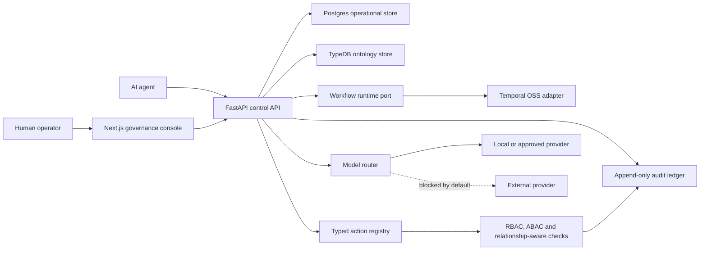

# Limes Axis Architecture

Limes Axis is the sovereign AI control plane for European operations. The open
core is designed to be self-hostable, auditable and extractable into separate
modules or repositories when Cloud, Enterprise, connectors, SDK, deployment or
docs grow beyond the product repo.

## System Shape

## Foundation Modules

- `apps/web`: Next.js governance console shell.
- `services/api`: FastAPI control API, config, errors, tenancy, permissions,
  model routing, action registry, audit models, Alembic migrations and TypeDB
  ontology boundary.
- `services/worker`: workflow runtime port and Temporal adapter.
- `packages/schemas`: shared public schemas.
- `infra/docker`: self-hosted local runtime for Postgres, TypeDB, Temporal,
  MinIO and Keycloak.

## Data Boundaries

Postgres owns operational records that need transactional semantics: tenants,
actors, approval records, action runs and append-only audit events. TypeDB owns
the operational ontology: actors, organizations, assets, processes, workflows,
operations, policies, approvals, audit evidence and relationship primitives.

Search starts from Postgres and remains behind an adapter until a specialized
engine is justified.

## Runtime Boundaries

Temporal is the first workflow engine, but application code depends on an Axis
workflow runtime port. This keeps orchestration replaceable and makes future
Cloud, Enterprise and deployment extraction cleaner.

The model router is provider-agnostic. External provider egress is blocked by
default and must be explicitly enabled by policy. The current public Platform
slice exposes read-only model route telemetry and synthetic cost estimates; live
provider adapters, persisted usage records, budget enforcement and
OpenTelemetry-emitted route spans remain behind the runtime boundary.

## Identity Boundaries

Axis is OIDC-first. The API can validate bearer tokens against configurable
issuer, audience, algorithms and JWKS settings, with Keycloak/self-hosted OIDC
as the default local path. Token claims provide the authenticated tenant, actor
and scopes used by mutation endpoints. Demo request-body actor fields remain
available only as standalone fallback metadata when OIDC auth is optional and no
bearer token is supplied.

## Permission Boundaries

Axis starts with RBAC, ABAC and relationship-aware permission primitives. The
first implementation evaluates explicit roles, action attributes and resource
relationships before action execution or approval. The current Platform
mutation endpoints bind approval decisions and action run requests to
OIDC-derived actors and scopes when authenticated, then apply the existing
permission checks before persistence.

## Expansion Rule

The repository starts unified, but module boundaries are designed to be
extractable from day one. Extraction becomes mandatory when at least two of
these conditions are true:

- release cadence diverges;
- ownership or team boundaries diverge;
- enterprise-only secrets, permissions or deployment logic appear;
- customer-specific integrations become material;
- SDKs need independent versioning;
- connector surface becomes large;
- Cloud operations differ materially from the OSS core;
- docs/community needs outgrow the product repo.

Likely future repositories:

- `limes-axis-cloud`
- `limes-axis-enterprise`
- `limes-axis-connectors`
- `limes-axis-sdk`
- `limes-axis-deploy`
- `limes-axis-docs`
