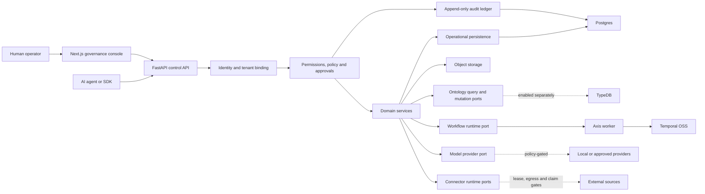

# Limes Axis Architecture

This document describes the architecture implemented in the repository today.
It is intentionally about current component ownership, data flow and trust
boundaries. Delivery sequence and superseded intermediate designs belong in the
[architecture changelog](./architecture-changelog.md).

This private repository is the complete commercial source of truth. The
[repository-topology ADR](./adr/0002-commercial-source-and-oss-export-boundary.md)
owns the separate, future OSS publication boundary; no OSS repository or export
path is part of the current runtime. The
[edition capability matrix](./editions.md) classifies product scope without
treating mixed top-level directories as release units.

## Current Component and Data Flow

```mermaid
flowchart LR
  Operator["Human operator"] --> Console["Next.js governance console"]
  Agent["AI agent or SDK"] --> API["FastAPI control API"]
  Console --> API

  API --> Identity["Identity and tenant binding"]
  Identity --> Governance["Permissions, policy and approvals"]
  Governance --> Domain["Domain services"]
  Governance --> Audit["Append-only audit ledger"]

  Domain --> Persistence["Operational persistence"]
  Persistence --> Postgres["Postgres"]
  Audit --> Postgres
  Domain --> ObjectStore["Object storage"]
  Domain --> OntologyPort["Ontology query and mutation ports"]
  OntologyPort -. "enabled separately" .-> TypeDB["TypeDB"]

  Domain --> WorkflowPort["Workflow runtime port"]
  WorkflowPort --> Worker["Axis worker"]
  Worker --> Temporal["Temporal OSS"]

  Domain --> ModelPort["Model provider port"]
  ModelPort -. "policy-gated" .-> Models["Local or approved providers"]
  Domain --> ConnectorPort["Connector runtime ports"]
  ConnectorPort -. "lease, egress and claim gates" .-> Sources["External sources"]
```

The console and SDKs call the control API; they do not read stores or invoke
providers directly. The API is the composition root for identity, authorization,
domain services and persistence. External side effects remain behind typed ports
and explicit configuration gates.

## Current Runtime Shape

- **Console and public contracts.** `apps/web` renders the governance console and
  parses API responses through local runtime contracts. `packages/schemas` owns
  versionable public JSON schemas.
- **Connector authoring.** `axis_sdk.connector_authoring` owns versioned source
  ports and an offline reference in the existing Python SDK. Production adapters
  retain their current API/worker ports and governance owners; SDK imports do
  not register or enable sources. See the
  [authoring contract ADR](adr/0005-connector-authoring-contract.md).
- **Control API.** `services/api` exposes the HTTP surface and currently composes
  most routes and dependencies in `axis_api.main.create_app`. Domain modules own
  behavior even where route registration still lives in that composition root.
  Model HTTP handlers live in `axis_api.routes.models`; the composition root
  supplies existing shared dependency and authorization callables. The
  [route inventory](api-route-inventory.md) records every operation and the
  [extraction guide](api-route-extraction.md) defines the remaining migration.
- **Operational data.** Postgres is the source of truth for tenants, identities,
  approvals, policies, actions, runs, connector metadata, usage projections and
  append-only audit evidence. Raw connector rows and materialized export bundles
  belong in object storage; only metadata, digests and opaque storage references
  belong in Postgres.
- **Ontology.** Ontology access goes through Axis query and mutation ports. The
  persisted Postgres-backed reference graph supports the public demo path;
  TypeDB query and mutation runtimes are enabled independently.
- **Workflows.** The API depends on an Axis workflow port. The worker implements
  that port with Temporal and owns workflow execution, schedules and activities.
- **External providers.** Model and connector adapters are replaceable. Provider
  egress, live connector reads and graph mutation are disabled unless their
  explicit runtime, permission and evidence gates pass.
- **Deployment.** The repository ships one self-hosted topology for the API,
  console, worker, Postgres, TypeDB, Temporal, MinIO and Keycloak. Readiness and
  deployment contracts are checked from the same repository.
- **Configuration.** Seven capability models own API setting declarations;
  `axis_api.config.Settings` loads one flat environment facade and retains the
  existing aliases and caller attributes. Cross-capability production validation
  runs before application initialization. See [configuration](configuration.md)
  and the [configuration ownership ADR](adr/0004-capability-settings-facade.md).

## Boundary Ownership

The owner links identify where a boundary is implemented. The test links identify
the nearest contract evidence; they are not an exhaustive test inventory.

| Boundary | Current responsibility | Owning modules | Contract tests |
| --- | --- | --- | --- |
| Console/API | Browser transport, response validation and the public HTTP composition root | [`apps/web/lib/axis-api.ts`](../apps/web/lib/axis-api.ts), [`apps/web/lib/runtime-contracts`](../apps/web/lib/runtime-contracts), [`axis_api/main.py`](../services/api/src/axis_api/main.py) | [`axis-api.test.ts`](../apps/web/lib/axis-api.test.ts), [`runtime-contracts.test.ts`](../apps/web/lib/runtime-contracts.test.ts), [`test_health.py`](../services/api/tests/test_health.py) |
| Identity and tenancy | OIDC verification, browser sessions, principal hydration and tenant binding | [`identity.py`](../services/api/src/axis_api/identity.py), [`identity_session.py`](../services/api/src/axis_api/identity_session.py), [`oidc_code_flow.py`](../services/api/src/axis_api/oidc_code_flow.py), [`tenant_admission.py`](../services/api/src/axis_api/tenant_admission.py) | [`test_identity.py`](../services/api/tests/test_identity.py), [`test_identity_session_gate.py`](../services/api/tests/test_identity_session_gate.py), [`test_oidc_authorization_code_session.py`](../services/api/tests/test_oidc_authorization_code_session.py), [`test_tenant_isolation.py`](../services/api/tests/test_tenant_isolation.py) |
| Authorization, approvals and audit | RBAC/ABAC/relationship checks, governed decisions, outbox delivery and append-only evidence | [`permissions.py`](../services/api/src/axis_api/permissions.py), [`approval_decisions.py`](../services/api/src/axis_api/approval_decisions.py), [`approval_outbox.py`](../services/api/src/axis_api/approval_outbox.py), [`audit.py`](../services/api/src/axis_api/audit.py), [`audit_queries.py`](../services/api/src/axis_api/audit_queries.py) | [`test_permissions.py`](../services/api/tests/test_permissions.py), [`test_approval_decisions.py`](../services/api/tests/test_approval_decisions.py), [`test_audit_queries.py`](../services/api/tests/test_audit_queries.py) |
| Operational persistence | SQLAlchemy sessions, relational models, repositories and ordered migrations | [`db.py`](../services/api/src/axis_api/db.py), [`models.py`](../services/api/src/axis_api/models.py), [`persistence.py`](../services/api/src/axis_api/persistence.py), [`migrations`](../services/api/migrations) | [`test_persistence.py`](../services/api/tests/test_persistence.py), [`test_migration_chain_postgres.py`](../services/api/tests/integration/test_migration_chain_postgres.py) |
| Ontology | Graph queries, relationship-scoped filtering and explicitly gated mutations | [`ontology/queries.py`](../services/api/src/axis_api/ontology/queries.py), [`ontology/mutations.py`](../services/api/src/axis_api/ontology/mutations.py), [`ontology_authorization.py`](../services/api/src/axis_api/ontology_authorization.py) | [`test_ontology_queries.py`](../services/api/tests/test_ontology_queries.py), [`test_ontology_mutations.py`](../services/api/tests/test_ontology_mutations.py), [`test_ontology_mutation_runtime.py`](../services/api/tests/integration/test_ontology_mutation_runtime.py) |
| Workflow runtime | API-side workflow contract plus worker-side Temporal implementation | [`workflow_runtime.py`](../services/api/src/axis_api/workflow_runtime.py), [`workflow_port.py`](../services/worker/src/axis_worker/workflow_port.py), [`temporal_adapter.py`](../services/worker/src/axis_worker/temporal_adapter.py) | [`test_workflow_runtime.py`](../services/api/tests/test_workflow_runtime.py), [`test_temporal_adapter.py`](../services/worker/tests/test_temporal_adapter.py) |
| Model routing | Endpoint registry, provider selection, invocation evidence and guarded egress | [`model_endpoints.py`](../services/api/src/axis_api/model_endpoints.py), [`model_providers.py`](../services/api/src/axis_api/model_providers.py), [`model_invocations.py`](../services/api/src/axis_api/model_invocations.py) | [`test_model_endpoints.py`](../services/api/tests/test_model_endpoints.py), [`test_model_providers.py`](../services/api/tests/test_model_providers.py), [`test_model_invocation_runtime_integration.py`](../services/api/tests/integration/test_model_invocation_runtime_integration.py) |
| Connectors and object storage | Connector contracts, governed execution, source ingestion and payload/artifact storage | [`connectors.py`](../services/api/src/axis_api/connectors.py), [`connector_execution.py`](../services/api/src/axis_api/connector_execution.py), [`connector_source_ingestion.py`](../services/api/src/axis_api/connector_source_ingestion.py), [`object_storage.py`](../services/api/src/axis_api/object_storage.py), [`connector_live_sync_activities.py`](../services/worker/src/axis_worker/connector_live_sync_activities.py) | [`test_connector_execution.py`](../services/api/tests/test_connector_execution.py), [`test_connector_source_ingestion.py`](../services/api/tests/test_connector_source_ingestion.py), [`test_connector_source_ingestion_runtime.py`](../services/api/tests/integration/test_connector_source_ingestion_runtime.py), [`test_source_ingestion_wiring.py`](../services/worker/tests/test_source_ingestion_wiring.py) |
| Public schemas | Cross-client JSON schema definitions and schema validation | [`packages/schemas`](../packages/schemas), [`validate-schemas.mjs`](../packages/schemas/scripts/validate-schemas.mjs) | [`test_schemas_package_contract.py`](../services/api/tests/test_schemas_package_contract.py) |
| Deployment boundary | Self-hosted service topology, environment configuration and public-safe readiness | [`docker-compose.yml`](../infra/docker/docker-compose.yml), [`config.py`](../services/api/src/axis_api/config.py), [`deployment_readiness.py`](../services/api/src/axis_api/deployment_readiness.py) | [`test_deployment_readiness.py`](../services/api/tests/test_deployment_readiness.py), [`test_deployment_package_contract.py`](../services/api/tests/test_deployment_package_contract.py) |

## Governed Data Flows

### Read Path

1. The console, an agent or an SDK calls the API.
2. The API resolves the authenticated principal and tenant before a tenant-scoped
   read starts.
3. Domain query code reads Postgres, the object-store metadata boundary or an
   enabled ontology adapter.
4. The API returns public-safe response models; secrets, raw credentials and raw
   connector rows are not response fields.

### Governed Mutation Path

1. Identity and tenant scope are bound once at the API boundary.
2. Permission and policy checks run before the domain transition.
3. Approval, idempotency and replay rules are applied where the operation can
   create an external or durable effect.
4. The transaction persists operational state and append-only audit evidence.
5. Workflow signals or external adapters are invoked only through their ports;
   the approval outbox is available where crash-atomic delivery is required.
6. A path that must await an external runtime inside the request commits the
   record carrying its idempotency key and decision evidence before that call
   and records the outcome afterwards, so no transaction is held across the
   await and the key survives an interrupted process. Governed model
   invocation is the path on this contract today; the inventory of the
   remaining external-await paths is in
   [external-await transaction boundaries](./performance-external-await-boundaries.md).

### Connector Ingestion Path

1. Source discovery and activation bind a connector to approved source metadata.
2. Dispatch and extraction require the configured runtime gates plus current
   lease, egress-policy and worker-claim evidence.
3. Read-only extraction writes raw row envelopes to object storage.
4. Postgres stores metadata, checksums, watermarks and provenance, never the raw
   row payload.
5. Reconciliation reports divergence without silently repairing either store.

## Current Limits

- The API composition root remains large; route-module extraction has not yet
  changed the runtime ownership described above.
- Live external connectors and provider egress are opt-in capabilities, not a
  default deployment posture.
- The TypeDB runtime is an adapter boundary and may be disabled independently of
  the persisted public reference graph.
- The commercial repository is still a unified monorepo. A future OSS edition
  is a files-only, fresh-history export governed by the topology ADR and a
  capability allowlist; it is not a runtime module split or an automatic sync.

## Detailed Current Contracts

- [Platform overview](./platform-overview.md)
- [Persistence](./platform-persistence.md)
- [Identity and tenants](./platform-tenants.md)
- [Permissions and policies](./platform-policies.md)
- [Approvals](./platform-approvals.md)
- [Audit](./platform-audit.md)
- [Connectors](./platform-connectors.md)
- [Connector capability matrix](./connector-capabilities.md)
- [Connector authoring contract](./connector-authoring.md)
- [Ontology](./platform-ontology.md)
- [Workflows](./platform-workflows.md)
- [Model routing](./platform-model-routing.md)
- [Deployment](./deployment.md)
- [Threat model](./threat-model.md)
- [Compliance applicability and evidence](./compliance-applicability-and-evidence.md)

## Keeping This Document Current

Pull requests must use the architecture-drift check in the
[pull request template](../.github/PULL_REQUEST_TEMPLATE.md). A change that moves
component ownership, changes a data path, crosses a trust boundary or introduces
a new runtime dependency must update this document in the same pull request.
Record the reason and delivery sequence in the
[architecture changelog](./architecture-changelog.md) or in a dedicated ADR;
do not append implementation chronology to this current-state view.
