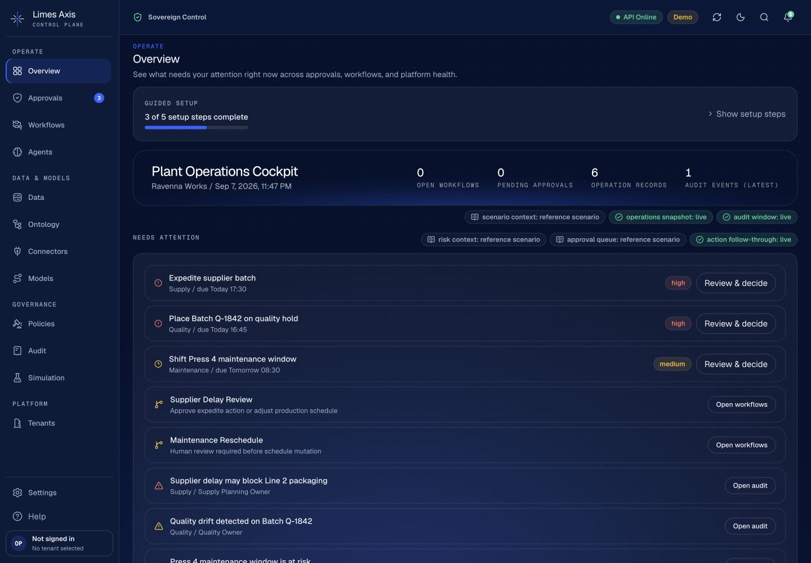
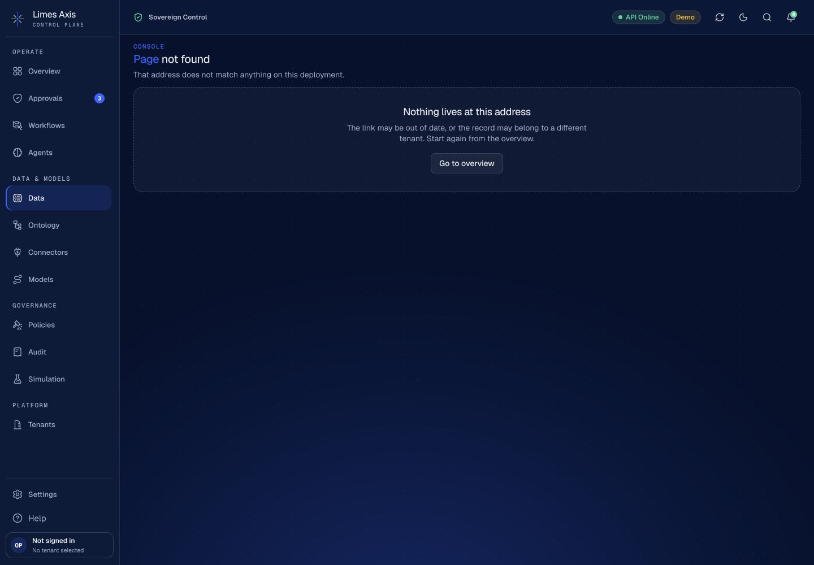
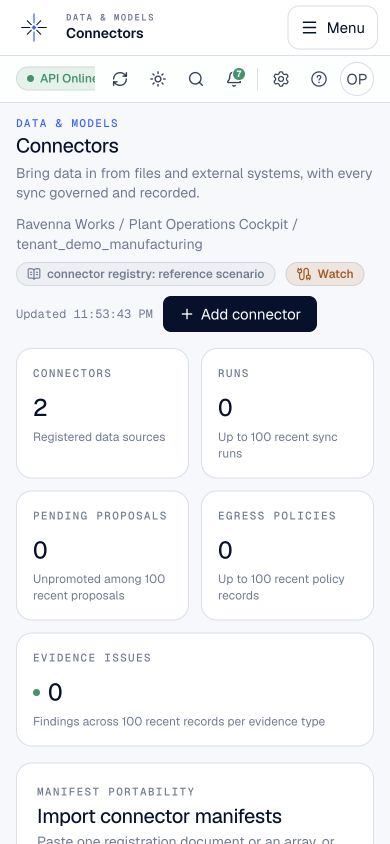
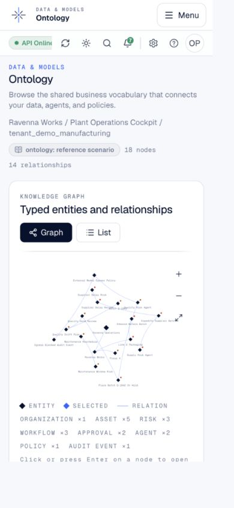
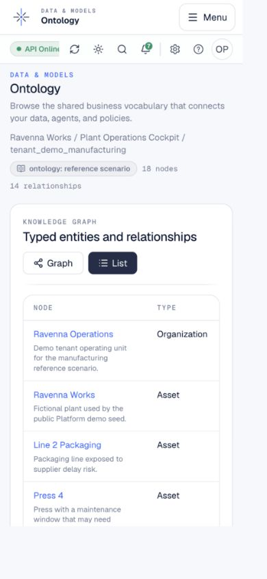

# Console audit and redesign rebaseline — 7–8 September 2026

Issue [#350](https://github.com/Limes-Labs/limes-axis/issues/350), following
[PR #318](https://github.com/Limes-Labs/limes-axis/pull/318). This is the current
execution checklist for the console part of [#276](https://github.com/Limes-Labs/limes-axis/issues/276).
The July [implementation plan](superpowers/plans/2026-07-11-console-redesign.md)
remains design history; its unchecked implementation steps do not mean those
features are absent today.

**Audit outcome: PASS — inventory and rebaseline complete. Product findings:
FAIL — four focused follow-ups remain.** No application behavior changes in this
slice. The existing console already contains most of phases 1–6; rebuilding
those phases would duplicate shipped components. The next work should improve
an operator's ability to reach data, inspect sources and select entities.

## Evidence and scope

Audited application revision: `0b78b876dda3833126c82821457ca57ca3776c69`.
Production Next.js build, real local FastAPI and PostgreSQL 16, migrations through
`0066_s3_source_checkpoint`. Browser observations were captured on 7 September
2026 UTC; final keyboard checks crossed midnight in Europe/Rome. There were no
HTTP response stubs in the manual walkthrough.

The database was dedicated to this audit. Existing migrations supplied the
manufacturing reference, then `POST /demo/bootstrap` registered
`tenant_demo_manufacturing` using `demo:scenario:bootstrap`. A synthetic policy
`console_audit_gate` was authored through `POST /platform/policies` with
`platform:policy:author` to inspect its detail route. Both operations used the
existing development API. This environment used development claims, not verified
SSO. Reference records are explicitly labelled by the UI and do not demonstrate
executed workflows or live provider calls. Registry reads themselves add audit
records, so counts vary between captures.

The manual matrix covered all **16 App Router pages**, plus the advertised but
absent `/data` destination, at actual CSS viewports **1440×1000, dark**, and
**390×844, light**. Overview was also checked at 390×844 in dark mode. These are
browser viewports, not physical-device certification or a full theme/device
cross-product. Browser zoom changed during the session; later viewport requests
were compensated and `innerWidth`/`innerHeight` were checked before measurements.

[Route observations](evidence/console-audit-2026-09-07/route-observations.json)
record URL, timestamp, actual viewport, theme, headings, main count and document
width. Duplicate early Overview observations were replaced by the later capture
after tenant bootstrap. Additional policy records show empty and populated states.
The [manifest](evidence/console-audit-2026-09-07/manifest.json) contains SHA-256
hashes for the retained evidence and a reproducible runtime-source fingerprint.
Screenshots are selected examples; the JSON inventory covers the full matrix.
All retained data is synthetic.

## Route inventory

**Completed** means the planned presentation is present and its read surface or
explicit gate was observed. **Partial** means a measured UX gap or an important
populated/mutating path remains unverified. **Missing** means the advertised page
does not resolve. These statuses describe this audit, not production readiness.
Shared shell findings apply to every route, including completed ones.

| Route | State | Observed behavior and remaining boundary | Source / existing focused tests |
| --- | --- | --- | --- |
| `/` | Completed | One page title; attention, posture and evidence sections; onboarding progress and source labels. No duplicate Overview heading. Approval persistence and empty-tenant journey need separate live validation. | `components/platform-overview.tsx`, `components/overview/*.test.tsx` |
| `/approvals` | Partial | Decision-first inbox and reference items visible. Confirmation/evidence components exist; a real authorized decision and follow-through were not performed. | `components/approval-inbox.test.tsx`, `components/approvals/approval-decision-card.test.tsx` |
| `/workflows` | Partial | Explicit empty runtime state. Filters/timeline implemented; populated Temporal timeline and controls not exercised. | `components/workflow-console.tsx`, `components/workflow-console.test.tsx` |
| `/agents` | Completed | Reference registry and Overview / Permissions / Runs / Evidence detail tabs present. Executed agent runs not demonstrated. | `components/agents/agent-detail.tsx`, `components/agents/agent-registry.test.tsx` |
| `/data` | Missing | Shared navigation advertises a destination returning HTTP 404. Catalog components already exist but the App Router page is absent. Follow-up #428. | `lib/nav.ts`, `components/data-catalog/`; no `app/data/page.tsx` |
| `/connectors` | Partial | Two reference connectors, Add connector and decomposed detail/run/governance surfaces exist. Advanced manifest form precedes the registry; follow-up #429. No governed import/sync executed. | `components/connector-console/`, wizard, runs and manifest tests |
| `/ontology` | Partial | 18 reference nodes, 14 relationships, graph/list, zoom controls and entity sheet present. Narrow-screen readability and close-focus findings #430/#431. | `components/ontology-explorer.test.tsx`, `components/ontology/entity-sheet.test.tsx` |
| `/ontology/[nodeId]` | Completed | `asset_batch_q_1842` loads full entity context, relationships and read boundaries. Sheet's full-page link resolves. Other identity/denial states not certified. | `app/ontology/[nodeId]/page.tsx`, `components/ontology-entity-detail.tsx` |
| `/model-routing` | Completed | Reference routing / Live invocations tabs exist and explain their distinct sources. External model invocation not performed. | `components/model-routing-console.test.tsx` |
| `/policies` | Completed | Explicit empty state, authoring controls and populated registry after synthetic API authoring. UI authoring was not exercised. | `components/policy-registry.test.tsx` |
| `/policies/[policyId]` | Completed | Synthetic policy conditions, revisions and single evaluation tab present; ArrowRight and browser Back update selected tab/URL. Evaluation/revision mutation not performed. | `components/policy-detail.test.tsx` |
| `/audit` | Completed | Ledger evidence, integrity summary and export control present. A signed export download was not validated in this audit. | `components/audit-explorer.test.tsx` |
| `/simulation` | Partial | Explicit empty runtime history. `RunReplayForm` exists in the populated branch; absence in this fixture does not mean missing implementation. Replay comparison not run. | `components/simulation-console.test.tsx`, `components/simulation/run-replay-form.test.tsx` |
| `/tenants` | Completed | Registered tenant visible, explicit provisioning controls. Provisioning through UI not performed. | `components/tenant-registry.test.tsx`, `components/tenant-provision-form.test.tsx` |
| `/tenants/[tenantId]` | Partial | Tenant detail, vocabulary/quota/lifecycle surfaces load for the fixture tenant; destructive and governed writes untested. | `app/tenants/[tenantId]/page.tsx`, tenant vocabulary/quota/lifecycle tests |
| `/settings` | Completed | System-status content split into Readiness / Identity / Deployment / Support. End key selects Support and scrolls it fully into view at 390px. | `components/platform-settings-console.test.tsx` |
| `/settings/sessions` | Partial | Explicit SSO-required session gate. Authenticated session list and revocation not run. | `components/session-security-console.test.tsx` |

Source paths in the table are relative to `apps/web/`. Route existence is checked
against `app/**/page.tsx`, not inferred from navigation labels or component tests.

## Findings and bounded implementation work

| Priority | Finding and measured task cost | Small follow-up and acceptance target |
| --- | --- | --- |
| P1 | **Data navigation ends at 404.** Sidebar/mobile share the same unavailable `/data` link. `lib/nav.test.ts` expecting that link does not prove route existence. | [#428](https://github.com/Limes-Labs/limes-axis/issues/428): restore the intended existing catalog destination or consistently hide it until available; add route-level navigation regression. |
| P2 | **Connector inspection follows advanced JSON authoring.** Registry heading is at document y=1492 CSS px on 390×844 (1.77 viewport heights), versus y=852 on 1440×1000. | [#429](https://github.com/Limes-Labs/limes-axis/issues/429): put advanced manifest import/export behind an accessible disclosure; registry precedes it by default. Compare the same fixture before/after. Coordinate broader personas with #351. |
| P2 | **Initial graph labels are unreadable on mobile.** At 390×844, 18 SVG label bounding boxes are approximately 5.9 CSS px high. This measures rendered text bounds, not computed font size or a WCAG threshold. Existing List view offers readable labels. | [#430](https://github.com/Limes-Labs/limes-axis/issues/430): reuse a readable narrow-screen initial view while preserving explicit view choice, keyboard activation and deep links. Verify locating Batch Q-1842 before/after. |
| P2 | **Closing entity sheet loses the opener's focus.** Enter opens the sheet and focuses Close; Escape removes the dialog and entity query parameter, but focus becomes BODY. Reproduced after click as well. | [#431](https://github.com/Limes-Labs/limes-axis/issues/431): return focus to list/graph opener, with a safe missing-opener fallback; add close-and-continue keyboard regression. |

[Connector mobile geometry](evidence/console-audit-2026-09-07/connector-mobile-geometry-390.json),
[desktop geometry](evidence/console-audit-2026-09-07/connector-desktop-geometry.json),
[graph geometry](evidence/console-audit-2026-09-07/ontology-mobile-geometry.json) and
[focus result](evidence/console-audit-2026-09-07/ontology-keyboard.json) retain the measurements.
These findings justify specific task improvements; they do not justify new
visual identity, API contracts or a wholesale console rebuild.

Navigation and duplication: grouped navigation, one page-level heading, shared
loading/error/empty primitives, tabbed detail and the consolidated Overview
already exist. Across the settled route captures, no document-level horizontal
overflow was measured and each page had one main landmark and one h1. Tables
can scroll internally; that is distinct from page overflow. Graph and full-page
entity views intentionally share content for different navigation contexts.
Raw tenant IDs/scopes remain secondary copy in several surfaces; moving all of
them is not justified by this audit alone. The historical “System status” intent
is expressed in Settings content while the page title remains Settings; a rename
is not a delivery gap without a measured user benefit.

Accessibility checks: mobile menu retained focus inside its dialog for 16 Tab
presses and Escape restored the menu trigger. Policy tabs responded to ArrowRight
and history navigation. Settings Support remained reachable by keyboard despite
horizontal tab scrolling. See [menu](evidence/console-audit-2026-09-07/mobile-navigation-keyboard.json),
[policy](evidence/console-audit-2026-09-07/policy-keyboard.json) and
[settings](evidence/console-audit-2026-09-07/settings-keyboard.json) evidence.
These are targeted checks, not an accessibility certification. A raw count of
controls smaller than 24px was not treated as failure: spacing, inline-control
exceptions, hidden dialog background and SVG targets require separate assessment.

## Updated phase checklist

Checked items mean present/observed deliverables; they do not retroactively claim
that each historical branch or PR was created. Existing test files are regression
coverage, not proof of the live-service paths listed as NOT RUN below.

- [x] **Phase 1, tasks 1.1–1.5, 1.7–1.9:** test harness, shared states/primitives,
  scaffold, retained query data, topbar decomposition, command menu and single
  page headers are implemented. Keep their current tests; do not rebuild them.
- [x] **Phase 1, task 1.6:** grouped navigation and approval badge exist.
- [ ] Close the advertised-route mismatch in **#428**. Historical task 1.10's
  phase-sized PR instruction is superseded by individual follow-ups.
- [x] **Phase 2, tasks 2.1–2.2:** decision card/confirmation and action-first
  Overview sections exist. Keep component separation and independent query states.
- [ ] **Task 2.3 live gate:** authorized approval -> persisted decision -> audit
  link remains NOT RUN here; retain as a verification prerequisite for changes
  to that flow, not a duplicate rebuild issue.
- [x] **Phase 3, tasks 3.1–3.2:** agent tabs and workflow filters/timeline are
  implemented; empty runtime workflows were observed.
- [ ] **Task 3.3 live gate:** exercise populated agent/workflow runs against the
  governed runtime when changing those flows; this audit does not claim it ran.
- [x] **Phase 4, tasks 4.1–4.4:** connector decomposition, add wizard, preview/run
  controls, ontology sheet/list/zoom all exist.
- [ ] Improve source inspection in **#429**, entity lookup in **#430**, and sheet
  focus in **#431**; these replace the broad visual rebuild proposal.
- [ ] **Task 4.5 live gate:** authorized CSV import -> governed preview sync ->
  audit evidence remains NOT RUN in this fixture.
- [x] **Phase 5, tasks 5.1–5.4:** audit export UI, replay form, model tabs and policy
  tabs/single evaluator are implemented. Empty simulation is an explicit state.
- [ ] **Task 5.5 live gate:** replay, verified export and policy evaluation remain
  NOT RUN here. No blanket phase-5 rewrite is queued.
- [x] **Phase 6, tasks 6.1–6.3:** Settings tabs, sessions entry, onboarding checklist
  and tenant-scoped demo badge/bootstrap integration exist.
- [x] **Task 6.4 implementation:** control-room, connectors-flow and onboarding
  Playwright story specs exist. This audit adds the current route/viewport matrix.
- [ ] **Task 6.4 remaining verification:** real SSO, empty-tenant stateful story,
  both themes across all devices and assistive-technology pass remain NOT RUN.
- [x] **Task 6.5 documentation rebaseline:** current inventory/evidence and this
  checklist replace outdated assumptions about unimplemented phases.
- [ ] [#351](https://github.com/Limes-Labs/limes-axis/issues/351) remains the
  existing bounded next design slice for simple/advanced onboarding. It must
  build on the existing checklist/wizard rather than recreate them.

## Reproduction and validation

Use an isolated checkout at the audited revision, `make install`, a fresh local
PostgreSQL database and `uv run alembic upgrade head` from `services/api` with
`AXIS_POSTGRES_DSN` set. Keep provider, external-connector and workflow execution
features disabled. The fixture used PostgreSQL on 127.0.0.1:18351, API on :18350
and Next on :13350. No production configuration or credentials were copied.

Start the API with `AXIS_ENV=development`, `AXIS_OIDC_AUTH_REQUIRED=false`,
`AXIS_WORKFLOW_SIGNALS_ENABLED=false`, `AXIS_API_RATE_LIMIT_ENABLED=false`, and
`AXIS_CORS_ORIGINS='["http://127.0.0.1:13350"]'`; set matching public/API base URLs.
Bootstrap the demo tenant through the development endpoint above. To inspect
policy detail, author a synthetic action-execution policy with effect
`require_approval`, conditions `action_domains: [Operations]`, `risk_levels: [low]`,
and the policy-author scope. No approval, sync or provider action is needed.
Build with `NEXT_PUBLIC_AXIS_API_BASE_URL=http://127.0.0.1:18350 pnpm --filter
@limes-axis/web build`, then start the production web server. Navigate the route
table, wait for each loading state to settle, and record actual CSS dimensions.

- **PASS:** production web build, route walkthrough, targeted keyboard checks
  except the recorded sheet-focus finding; `/data` confirmed HTTP 404.
- **PASS:** nine existing read-only browser stories (control room, connector
  wizard opening and demo badge, on desktop/mobile/tablet). The first attempts
  needed the installed Chrome executable and a CORS origin for test port :13352;
  after fixture correction all nine passed without assertion changes.
- Full local `make verify` and exact-head CI results are recorded separately in
  the PR implementing #350; the source walkthrough above is not a substitute for
  those gates.
- **NOT RUN:** production/hosted deployment; real OIDC/IdP and role/tenant matrix;
  Temporal execution and populated runtime stories; external providers and
  connector ingestion; stateful approval/onboarding, session revocation, tenant
  lifecycle writes, signed export download and policy evaluation; screen reader,
  measured contrast, exhaustive target-size analysis and physical-device QA.

## Selected visual evidence

Overview already uses the shared action-first shell:

The advertised Data route is absent:

The connector entry screen puts advanced authoring before registry inspection:

The existing List view is a practical starting point for narrow-screen lookup:

