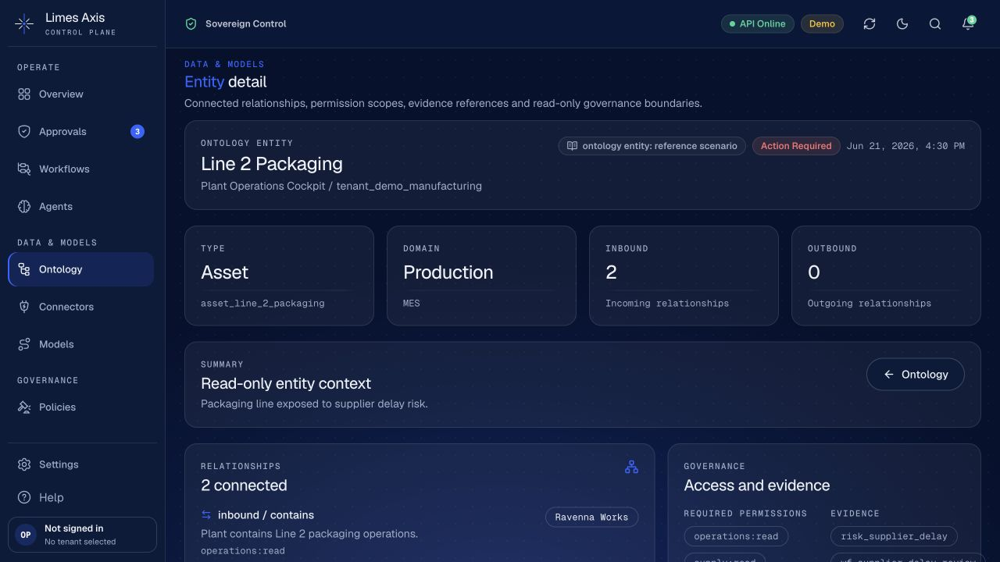
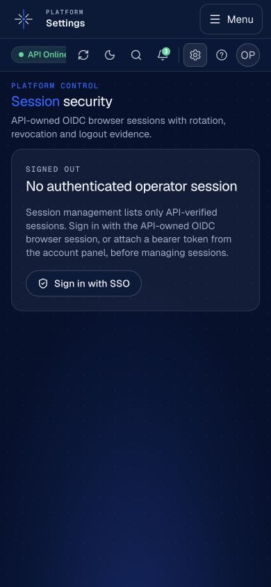
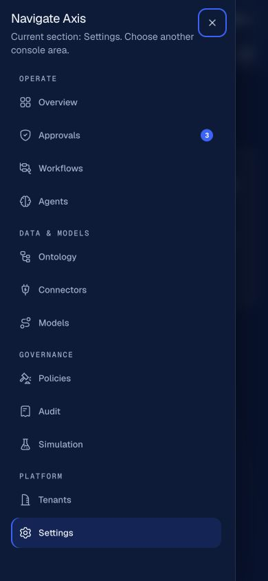

# Console quality audit — 2026-07-24

Second full review of `apps/web` (and the API surfaces it depends on), covering visual
design, usability, information hierarchy, product clarity, navigation, component
consistency, responsive behaviour, accessibility, bugs/edge cases, and maintainability.

Every item below was verified against source (file:line) before being listed. Items are
ordered by operator impact, not by area.

> Follow-up, 2026-07-28: the diagnosis below records the original audit baseline;
> checkbox state and resolution notes reflect the current PR branch.

## Root diagnosis

Three systemic causes account for most individual findings:

1. **A marketing design system is being used as a product design system.** Pill CTA
   buttons with glow shadows, 24px card radii, hover-lift surfaces, 300ms transitions and
   a two-tone headline device are landing-page vocabulary. In a dense operator console
   they read as dated and visually disconnected. 14 distinct font sizes, 7 weights, four
   coexisting control heights (32/34/38/46px) and zero tabular numerals.
2. **The provenance of data is not represented.** `useAxisQuery` can distinguish seven
   states (loading / live / refreshing / stale-after-failed-refresh / empty / unavailable /
   forbidden); the UI renders three. Nine console surfaces are backed by hand-authored
   seed JSON rather than queries, and the overview's headline numbers are array lengths of
   that seed payload. Green "ready" pills are hardcoded next to labels that can read
   "API unavailable".
3. **The URL does not describe the screen.** Selection, filters and tabs live in React
   state everywhere, so nothing survives a reload or can be shared — and two deep links
   that the product already builds and renders are never read, landing operators on the
   wrong record with no indication.

---

## P0 — Correctness and trust

- [x] **B1** `/approvals?action_run_id=` is built (`lib/agent-runs-live.ts:34`) and rendered
      (`components/agents/agent-runs.tsx:251`) but never read. `findApprovalById` falls back
      to the first approval, so the operator silently reviews the **wrong approval record**.
- [x] **B2** `/connectors?snapshot_id=` is built (`lib/connectors-demo.ts:510`) and rendered
      (`components/audit-explorer.tsx:248`) but never read; lands on the Overview tab
      instead of the evidence the link points at.
- [x] **B3** Silent `[0]` fallback on unknown id across 7 consoles — a shared link opened by
      a colleague shows a *different real record* with no error.
- [x] **B4** `components/action-registry.tsx:122-126` resets the operator's selection to the
      first action on **every** background refresh. The effect is also redundant.
- [x] **B5** Hardcoded green `signal-ready` pills whose label can read "… API unavailable"
      (11 sites, incl. `console-topbar.tsx:125`, `agent-registry.tsx:205`).
- [x] **B6** `model-routing-console.tsx:571` renders a green "Live executed" badge above a
      panel reading "Awaiting invocation API".
- [x] **B7** CSS class conflicts: `text-3xl` + `text-[13px]` and `font-display` + `font-mono`
      on one element (`policy-detail.tsx:274,289`, `tenant-detail.tsx:202`). Rendered size
      depends on stylesheet order, not intent.
- [x] **B8** No error boundary anywhere in `app/`. One render throw replaces the entire
      console with Next's unstyled 500 page — no nav, no theme, no way back.
- [x] **B9** Unmatched URLs render Next's built-in 404 *inside* the AppShell and inject an
      unlayered `body{background:#000}` rule that fights the theme (black text on navy, or
      a black page under a white sidebar).

## P1 — Product clarity and honest data

- [x] **D1** Overview hero facts are `.length` of the seeded reference arrays, labelled
      "Workflows / Approvals pending / Agents governed" (`platform-overview.tsx:81-83`).
      The correct, already-fetched values sit unused in `snapshot.data.metrics`.
- [x] **D2** "Recent audit events" shows a `limit: 25` capped fetch as a total; the evidence
      feed says "Showing 10 of 25" for a tenant with thousands.
- [x] **D3** Posture "Connectors" card counts audit events whose type starts with
      `connector.` — not connectors (`overview/posture-cards.tsx:45-48`).
- [x] **D4** Stale-after-failed-refresh is rendered as live on 15 of 18 surfaces.
- [x] **D5** 403 / 404 / 500 / network failure all render the identical panel; the hook
      exposes `errorStatus`/`errorCode`/`errorReason`/`errorRequestId` and only one call
      site in the app consumes any of it.
- [x] **D6** `ErrorPanel.onRetry` has **zero** call sites — every error state in the console
      is a dead end.
- [x] **D7** Reference-scenario surfaces declare `provenance` in the API response, and
      shared source pills distinguish them from persisted live data.
- [x] **D8** Valid empty tenant datasets return typed payloads with `provenance: "empty"`;
      the consoles render onboarding/empty panels rather than API errors.
- [x] **D9** API failures retain the server's validated request reference through runtime
      decoding, query state and mutation state; operators can expose it without rendering
      raw response bodies or debug fields.

## P1 — Navigation and deep links

- [x] **N1** `/audit` discards the URL param on first click and never writes selection back.
- [x] **N2** Selection and filters absent from the URL across 9 consoles.
- [x] **N3** Detail tabs are all uncontrolled `defaultValue` — a policy revision cannot be
      linked.
- [x] **N4** Ontology graph/list view and entity selection are URL-backed; entity
      traversal pushes history so Back walks the sheet history before leaving the page.
      Opaque node ids are encoded exactly, and explicit Close collapses the in-sheet
      traversal instead of manufacturing duplicate explorer history entries.

## P1 — Typography and controls

- [x] **T1** `Button` is a 46px pill with a glow shadow and a colour-flip hover; 42 of its
      call sites override its size, which is the codebase telling us the default is wrong.
- [x] **T2** `Select` never sets `appearance-none`, so every filter renders the OS dropdown
      arrow inside a styled field.
- [x] **T3** Control heights unified to 36px (button/input/select/icon-button).
- [x] **T4** Card radius 24px → 16px; hover-lift replaced with a border change.
- [x] **T5** 41 copies of an in-card `h2` at display-20px, incl. dynamic sentences and
      "No tenants match the current filter" set as a display heading.
- [x] **T6** 21 stat cards render strings (author email, event type, scope) at display-30px.
- [x] **T7** Zero `tabular-nums` in the app — every metric jitters as digits change.
- [x] **T8** Micro-labels exist in three dialects at five sizes (incl. a fractional 10.5px);
      table headers are uppercase mono **Signal blue** on every column.
- [x] **T9** Page `h1` at 26px, section headings at 24–30px inside cards.

## P2 — Production readiness

- [x] **P1** No security headers anywhere (no `headers()`, no middleware, no ingress
      annotations): the console is clickjackable and leaks ids via `Referer`.
- [x] **P2** Every browser tab reads "Axis Console"; no per-route metadata.
- [x] **P3** No `theme-color`; no `robots: noindex` on a governance console.
- [ ] **P4** CSP requires a nonce + middleware — separate piece of work, see below.

## P2 — Accessibility

- [x] **A1** Status conveyed by colour alone in source pills and metric tones.
- [x] **A2** `Select` chevron and spinner icons need `aria-hidden`.
- [x] **A3** Buttons that submit need a busy state so repeated submissions are impossible.

## P3 — Maintainability

- [x] **M1** 76 hand-rolled copies of the card shell class string vs. the `Card` primitive.
- [x] **M2** 21 hand-rolled stat cards vs. the `MetricStrip` primitive.
- [x] **M3** Dead code: `SectionHeading` (zero importers), `shouldUsePersistedWorkflowData`,
      `shouldUsePersistedReplayData`, five unreferenced `platform-overview.ts` helpers,
      `evidenceLabel` prop, orphan `ops-*` CSS classes referenced but never defined.
- [x] **M4** `lib/next-config.test.ts` asserts one trivial fact and implies config coverage.

## Follow-up verification — 2026-07-28

The follow-up was run against the product paths, not only the original visual demo:

- 827 web unit/component tests in 91 files, ESLint, TypeScript, and two production builds
  passed.
- 1,530 API tests passed with 14 infrastructure-gated skips; worker 51 passed with 3
  infrastructure-gated skips; the Python SDK passed all 104 tests. Ruff was clean across
  all three Python packages.
- 69 fail-closed/mock browser cases passed across desktop, Pixel 7 and iPad profiles.
- 21 read-only scenarios passed across the same three profiles against the real FastAPI
  application; 2 shared-state writes then passed once, serially, in Chromium.
- The in-app browser verified ontology graph selection, peer traversal, browser Back,
  opaque node identifiers, the full entity route, a single `main` landmark, zero
  horizontal overflow, and no browser-console errors at 1280×720.
- A second in-app browser pass at 390×844 verified the real mobile product shell with the
  drawer closed and open: grouped navigation, the current Settings destination, one
  `main` landmark, no horizontal overflow or console errors, body scroll lock, Escape
  close, and focus restoration all behaved correctly.
- Connector registry composition was exercised with 103 API records and 101 rendered UI
  records. Current manifests and latest successful runs are each loaded in one
  tenant-scoped query, so the view is neither capped at 100 nor N+1. Explicit
  `registry_origin` and `persisted_manifest` fields now preserve provenance through the
  API and runtime decoder instead of reconstructing it in the component layer.
- Selected connector detail is now authoritative for lifecycle controls, schema, preview
  data and export. Persisted-only provenance no longer leaves an active connector stuck in
  a pending state, and cross-tenant or cross-connector nested revisions fail decoding.
- Policy detail and Settings tabs are URL-backed and keyboard-tested. Discrete tab changes
  create navigable history entries, invalid policy comparison revisions are normalized,
  and visible tab panels expose a focus ring.
- Overview status indicators use distinct icon shapes and accessible status text, and
  sparkbars expose their numeric series without depending on colour or pointer-only
  titles.
- Production readiness now requires registered-tenant admission. Unknown tenants are
  rejected consistently across bearer, cookie, login and refresh paths; only the exact
  persisted `active` status is admitted. A serialized, auditable one-shot command closes
  the empty-registry bootstrap deadlock without weakening HTTP admission, and lifecycle,
  quota and provisioning cache invalidation now runs only after commit. Local development
  retains an explicit `claims_only` option.
- Concurrent identical notification acknowledgements converge on one acknowledgement and
  one audit event. Changed replay evidence and backward state transitions return a
  structured `409` without overwriting the persisted audit trail.
- Request correlation, safe mutation errors, stale async preview invalidation, and the
  browser-session refresh latch have focused regressions for the failure paths that
  originally escaped the happy-path tests.

These are direct captures from production Next.js builds backed by the real FastAPI
application and a temporary SQLite fixture seeded from the canonical migration payloads.
The ontology capture is 1280×720; the mobile captures are 390×844. Source labels
deliberately identify demo/reference data, so none of these images is presented as live
customer or distributed-infrastructure evidence.

---

## Requires a product or business decision

1. **Reference-scenario data (D7/D8).** Resolved for product truthfulness: reference,
   live, empty, stale, loading and unavailable states now remain distinct across the API
   and shared UI. Replacing every reference surface with a production integration remains
   a backend roadmap item; the console no longer presents those scenarios as live data.
2. **CSP strategy (P4).** Requires nonce + middleware, which opts routes into dynamic
   rendering. Cost is near zero here (all data is client-fetched) but it is an
   infrastructure decision.
3. **Server-rendered `notFound()` for detail routes.** Would return a real HTTP 404 for dead
   governance deep links, but requires moving detail fetches server-side — an architectural
   change to a consistently client-fetched app.
4. **Audit pagination.** The events endpoint exposes no total or cursor, so the UI can only
   ever say "Latest N".

## Remaining engineering follow-ups

- Connector manifest updates still use last-write-wins semantics. Revision-aware compare
  and swap remains a separate concurrency hardening task.
- Live Postgres migrations and the Temporal, TypeDB, MinIO and Keycloak boundaries remain
  unverified in this environment because the Docker daemon was unavailable. The current
  SQLite-backed browser evidence does not substitute for those checks.
