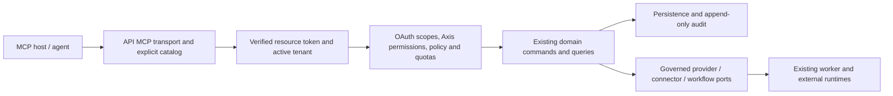

# MCP gateway boundary

This is the implementation contract for [#367](https://github.com/Limes-Labs/limes-axis/issues/367),
recorded by [ADR 0010](adr/0010-mcp-gateway-boundary.md). **No MCP endpoint,
OAuth resource registration, tool or task runtime is shipped by this slice.**
The requirements below govern subsequent gateway work; the
[architecture overview](architecture.md) continues to describe the running product.

## Protocol profile

The first Axis profile targets MCP **2026-07-28**, checked against the published
specification on 2026-09-06. Pin a dated revision in implementation and conformance
fixtures; never resolve `latest` at runtime. The
[versioning specification](https://modelcontextprotocol.io/specification/2026-07-28/basic/versioning)
defines per-request negotiation and `server/discover`. Support only this revision
initially; do not silently reinterpret an older client's request.

Use one authenticated `POST /mcp` endpoint within the control API deployment.
Follow [Streamable HTTP](https://modelcontextprotocol.io/specification/2026-07-28/basic/transports/streamable-http):
single JSON-RPC messages, JSON or request-scoped SSE responses, required version,
method and applicable name headers checked against body metadata. Reject missing,
malformed or mismatched mirrored headers before dispatch. Validate present
`Origin` values against configured exact origins. API discovery is also authenticated;
only the static OAuth metadata and existing liveness surfaces are public.

There is no initialization handshake, MCP session store, GET event stream or
session-based identity. Ignore legacy session/resumption headers without minting
or echoing them; GET and DELETE on `/mcp` return 405. The first profile does not
advertise subscriptions, client roots, sampling, elicitation or other extensions.
Core responses use `resultType: "complete"`. Only advertise a primitive after its
domain, authorization, response schema and release gates are implemented.

Protocol version, Axis capability schema revision and package version are
independent. Use stable names such as `axis.data.search_v1`; incompatible input,
output or authority changes require a new capability name/revision and an ADR.
Keep existing versions available during a documented migration window of at
least 90 days, except an explicitly reviewed emergency security withdrawal.
Protocol removals also follow the upstream protocol's own lifecycle policy.
Changing the pin requires an explicit compatibility diff and client conformance
run. No older protocol support is promised by this document.

## Demonstrations and editions

Demonstrate the real product with synthetic data in an isolated, authenticated
deployment, using the same permission, approval and audit paths. Keep reusable
fixtures and persisted example records; do not create a separately maintained
demo application or give MCP an anonymous demonstration mode. Retiring existing
REST demo fallbacks requires its own migration of presentations, onboarding and
CI before removal. This specification does not remove those supported paths.
The future OSS edition is a useful product edition under the
[edition policy](editions.md) and [export boundary](adr/0002-commercial-source-and-oss-export-boundary.md),
not a synonym for demo mode. Neither an OSS export nor a repository split is
part of the gateway implementation.

## Ownership and request flow



The API owns the adapter, catalog, principal binding and serialization. Domain
owners keep authorization decisions, transactions, idempotency, policy evaluation
and evidence. The worker keeps durable execution. The console remains the place
for human approval. There is no HTTP loopback with a forwarded bearer, direct
database tool, arbitrary REST dispatcher or new provider client in the adapter.
Current handlers often compose domain calls inline: extract only the needed
governed command when implementing a capability and keep both transports on it.
Calling a persistence method directly does not preserve a handler's gates.

Process every request in this order: transport size/origin checks; verified token;
registered active tenant; protocol/schema validation; catalog and scope checks;
object/relationship authorization and policy; shared quota admission; domain
operation; typed, redacted response with evidence references. Denials may be
recorded earlier. Do not read protected object content to decide basic admission.
Recheck authorization on every page, resource, tool, task poll and resumed operation.

## Authentication and least privilege

The gateway is an OAuth protected resource with a configured canonical HTTPS URI
(for example `https://axis.example/mcp`), distinct from the browser client and
ordinary API audience. Publish RFC 9728 metadata at the path corresponding to that
resource, with a trusted authorization-server issuer and minimal discovery scope.
Clients use the resource URI during authorization and token requests, and send
bearers in the Authorization header on every call. Reject other audiences; never
pass the inbound token to a provider, connector, worker, URL, log or tool result.
These are the [MCP authorization requirements](https://modelcontextprotocol.io/specification/2026-07-28/basic/authorization).

Axis implementation requirements:

- Reuse the verification primitives in [identity.py](../services/api/src/axis_api/identity.py)
  with a dedicated resource audience and configured issuer/algorithm allowlists.
  Require a valid access-token expiry, subject, tenant claim and issuer-defined
  client identity; distinguish access tokens from ID tokens through the issuer's
  documented token profile. Current generic principal extraction alone is not
  proof of this stricter profile. Reject missing or ambiguous claims.
- Use [tenant admission](../services/api/src/axis_api/tenant_admission.py) in
  `registered_only` mode on every call. No anonymous demo, API-key fallback,
  body-supplied scopes, default demo tenant or cross-tenant operator bypass.
  Tenant selection requires a newly authorized tenant-bound token, not an argument
  or remembered connection state. Reject conflicting identity fields even inside
  nested tool payloads; stamp domain actor and tenant from the verified principal.
- Restrict effective authority to the intersection of explicitly granted OAuth
  scopes, current Axis grants and capability policy. The verifier currently merges
  `scope`, `scp` and configured IdP role claims; that merged list must not turn a
  realm role into an OAuth grant. The adapter must retain the issuer's explicit
  scope grant separately. Use [permissions.py](../services/api/src/axis_api/permissions.py)
  for domain checks only after principal admission; its `None` principal path
  deliberately supports the existing demo and must never be reachable from MCP.
- Pre-register trusted clients initially. Configure the authorization server for
  authorization-code flow with PKCE S256, exact redirect URIs and client consent.
  Client implementations must validate the authorization response issuer and bind
  state/PKCE to that issuer. No runtime registration or arbitrary metadata URL
  fetch is required. Confidential machine clients need explicit service principals
  and tenant grants; they do not inherit a human approver's authority.
- Keep refresh tokens at the client/authorization server. Register a separate
  downstream credential under the existing credential and egress owners when a
  domain operation needs one; neither token substitution nor an all-powerful
  service token may erase the originating principal. Token/profile and issuer
  failures close access; no stale authentication fallback on verifier failure.

The `mcp:*` scopes below are **new proposed resource scopes, not existing Axis
grants or configuration settings**. `mcp:discover` permits only filtered discovery
and is the sole initial `scopes_supported` entry. Request further scopes per
operation, together with all applicable domain grants. None implies another or
supports wildcards. No initial scope allows approval decisions, action execution,
tenant administration, secret reads or unrestricted model invocation.
Clients choose the intended scope set during explicit connection/consent from
this documented profile and the user's authorized Axis configuration. A token
with only `mcp:discover` may receive empty lists; discovery must not expose an
ungranted catalog just to suggest upgrades. A later explicit consent/reauthorization
can add the selected grants without revealing another tenant's capabilities.

## Mapping to Axis layers

These are planned capability families, not an enabled catalog. Each concrete
entry must have an explicit name/URI template, input/output schema, scope list,
domain owner, policy/egress requirements and tested release state. No automatic
OpenAPI-to-tool generation. Hide entries without satisfied gates, including
disabled edition/runtime capabilities, before sorting or paginating discovery.

| Axis layer / MCP primitive | Planned surface and OAuth scope | Existing owner and further authority |
| --- | --- | --- |
| Data / resource | `axis://data/assets/{asset_id}`; `mcp:data:read` | [Data catalog and membership](../services/api/src/axis_api/data_assets.py), [stewardship](../services/api/src/axis_api/data_asset_stewardship.py), [lineage](../services/api/src/axis_api/data_asset_lineage.py); tenant/object visibility and metadata-only projection. Do not expose raw rows or storage credentials. |
| Ontology / resource | `axis://ontology/entities/{node_id}`; `mcp:ontology:read` | [Authorized entity reads](../services/api/src/axis_api/ontology_authorization.py); every relationship permission remains required. Do not substitute an unfiltered graph or direct TypeDB call. |
| Operations / resource | `axis://operations/workflows/{run_id}`; `mcp:operations:read` plus `workflows:read` | [Workflow queries](../services/api/src/axis_api/workflow_queries.py) and [history](../services/api/src/axis_api/workflow_history.py); validate tenant, object and result visibility. |
| Governance / resource | `axis://governance/audit/{event_id}`; `mcp:audit:read` plus `audit:read` | [Audit queries](../services/api/src/axis_api/audit_queries.py); tenant-scoped redacted evidence, with the existing audit read gate. Export, deletion and legal-hold administration are excluded. |
| Data and ontology / tool | `axis.data.search_v1`; relevant `mcp:data:read` and/or `mcp:ontology:read` | Compose authorized catalog/entity queries; apply ACLs before ranking, counts, snippets and pagination. The permission-safe search command is not implemented yet. No arbitrary SQL, TypeQL or external URL input. |
| Scenarios / tool | `axis.scenarios.quality_v1`; `mcp:scenarios:create` plus `quality:read`, `workflows:read`, `audit:read` | [Manufacturing scenario owner](../services/api/src/axis_api/manufacturing_operations.py), `generate_quality_risk_scenario`; records analysis and audit and needs idempotency. This is a write, even without external execution. Other verticals require their own domain/scopes entry. |
| Actions / tool | `axis.actions.propose_v1`; `mcp:actions:propose` plus the selected registry action's permissions and relationship scopes | [Action registry/policy](../services/api/src/axis_api/action_runs.py) and [agent proposal types](../services/api/src/axis_api/agent_runs.py); a proposal-only domain seam is required before exposure. The current `record_demo_action_run` can signal workflows and is not that seam. |
| Agent experience / prompt | `axis.review-proposal_v1`; `mcp:prompts:read` and all scopes for any embedded resources | Versioned operator-owned template in the gateway catalog; assemble only authorized evidence. [Agent context policy](../services/api/src/axis_api/agent_runs.py) remains authoritative if an agent run is involved. Retrieving a prompt does not execute a model or grant permission. |
| Execution / task extension | Opaque handle for an already authorized tool operation; `mcp:tasks:read` or `mcp:tasks:cancel`, plus the originating operation's current grants | API owns handle binding and projection; [workflow runtime](../services/api/src/axis_api/workflow_runtime.py), [outbox](../services/api/src/axis_api/approval_outbox.py) and worker retain execution/recovery ownership. Not enabled until durable task gates pass. |

Models, connectors and agents may provide evidence through these authorized
projections. Direct model invocation, connector activation/sync/writeback, agent
autonomy escalation, arbitrary provider selection and credential management are
outside the first catalog. Their existing controls are not implied by a read or
proposal scope. The gateway must neither manufacture approval nor change an
action's risk/autonomy/approval requirements from model-supplied arguments.

Axis resource URIs identify local objects; they are never fetchable network or
filesystem locations. They omit tenant identity, which comes from the token.
Resolve through explicit template parsers and tenant-scoped owner queries. Unknown,
foreign and invisible objects have the same sanitized unavailable response.
Capability descriptions and errors must not reveal another tenant's object names,
counts, integrations, schemas, policy details or availability.

## Pagination, cache hints and budgets

Follow [MCP pagination](https://modelcontextprotocol.io/specification/2026-07-28/server/utilities/pagination):
opaque cursors and optional `nextCursor`, with a server-selected page size. The
absence of a cursor ends the list; clients must not treat an empty string as an
end marker. Axis sets an initial maximum of 50 items, additionally limited by the
response budget. Sort authorized entries by stable identifier. A cursor binds
tenant, subject, client, capability/filter, authorization fingerprint, catalog
revision and expiry; integrity-protect it and avoid cleartext private state.
Changing any binding invalidates it with `-32602`; restart discovery. Set a
five-minute cursor lifetime and recheck current access before reading each page.
Do not expose pre-filter totals or turn a backend timeout into an empty success.

Use [MCP cache fields](https://modelcontextprotocol.io/specification/2026-07-28/server/utilities/caching)
`cacheScope: "private"` and `ttlMs: 0` on all cacheable results in the first profile;
HTTP responses use `Cache-Control: no-store`. Each page uses the same scope.
Any later positive TTL needs revocation tests and keys that include authorization
context, resource, arguments, protocol and catalog revision. Never share a cached
result across tokens, tenants or client principals, and never treat a cached
catalog as permission to call. Invalidate on reauthentication, scope/policy change
or tenant suspension. Tool effects and resumed/input-response exchanges are not
cacheable. A host may retain content already disclosed; authorization cannot
retract that copy, which is part of deployment/client consent.

The following are **initial design ceilings, not measured capacity or shipped
settings**. Enablement requires explicit deployment budgets and load evidence.
Use the stricter of the gateway ceiling and each existing tenant/domain limit.

| Budget | Initial ceiling | Enforcement owner |
| --- | --- | --- |
| JSON request / serialized response | 256 KiB / 1 MiB per operation, including SSE total | Transport checks bytes before parsing and before emission; bound decompressed size, nesting and schema complexity. Never slice JSON or drop audit/provenance fields. |
| Query page / search text | 50 items / 4 KiB | Capability schema and owner query; search only allowlisted collections with a bounded work budget. |
| Calls per minute | 60 per principal/client pair and 600 per tenant; burst at most the respective one-minute budget | Existing [rate-limit admission](../services/api/src/axis_api/rate_limit.py), extended with explicit MCP keys and shared fail-closed backend. Include discovery, failed authorized attempts and task polling. |
| In-flight work | 4 requests per principal/client and 20 per tenant | Shared atomic admission with expiry/recovery; local counters alone do not qualify across replicas. |
| Synchronous work | 10 seconds per call, bounded provider/query sub-deadlines | API/domain cancellation; no open database transaction across an external await. |
| Durable task handles | 10 active per tenant; 24-hour handle lifetime; suggested poll interval at least 2 seconds | Persisted task admission; domain budgets and evidence retention remain independent. |

Quota denial is HTTP 429 with `Retry-After`; unavailable admission storage is
503, never unlimited access. Reserve/check before work and release in all terminal,
timeout and disconnect paths. Retry a write only with its original idempotency
key; quota retries do not create a new operation. Oversized requests fail with
413; an oversized result produces a bounded error or an explicitly paginated
resource, never a successful truncated result. Use deployment and capability
kill switches; stopping new admission must preserve durable recovery/evidence.

## Errors and result contracts

Preserve the JSON-RPC request ID and an Axis `X-Request-Id` correlation value.
Do not echo untrusted payloads in messages. Use the upstream error codes rather
than inventing competing codes in its reserved range:

| Condition | Response |
| --- | --- |
| Missing/invalid/expired bearer or wrong audience | HTTP 401 with Bearer challenge and `resource_metadata`; no discovery content. |
| Insufficient OAuth scope | HTTP 403, `insufficient_scope` challenge with all scopes needed for this operation; only disclose an operation already visible to this principal. |
| Conflicting tenant input or policy denial on an already visible operation | HTTP 403 with a generic denial; no challenge that reveals hidden object permissions. |
| Unknown, foreign or relationship-invisible resource reference | Identical `-32602` unavailable response, with no existence or scope details. Keep the detailed denial only in authorized internal evidence. |
| Invalid JSON / RPC envelope / arguments or cursor | JSON-RPC `-32700` / `-32600` / `-32602`; HTTP 400 for invalid transport/envelope. Domain argument failures after a valid `tools/call` are tool execution errors. |
| Unknown RPC method | HTTP 404 with `-32601`. Unknown or undiscoverable tool names share `-32602`. |
| Unsupported version / mismatched headers | HTTP 400 with `-32022` and supported versions / `-32020`, respectively. |
| Missing required client task capability | `-32021`, with the required extension; reject before starting work that requires it. |
| Domain validation, conflict, runtime deferral or provider failure | `resultType: "complete"`, `isError: true`, bounded actionable code and retryability. Do not map deferral, timeout or unavailable evidence to success. |
| Unexpected server failure | `-32603`, generic message and correlation; sanitized internal diagnostics only. |

Tool results have versioned `outputSchema` and `structuredContent`; use a bounded
text equivalent where appropriate. Read results include the authorized object ID,
source/evidence references and observed/revision time. Writes return the persisted
proposal/scenario/run and audit IDs plus truthful status, including replay or
waiting for approval. Keep authority-bearing evidence separate from untrusted
source text. Schema validation applies before model content enters domain commands
and before output reaches the client. Resolve schemas locally; no remote `$ref`
fetch or arbitrary resource expansion. Tool annotations describe behavior but
never authorize it. See [MCP tools](https://modelcontextprotocol.io/specification/2026-07-28/server/tools).

Record authenticated discovery/read/denial and tool/task admission in the existing
append-only audit owner with tenant, actor, validated client, capability revision,
outcome, correlation and opaque evidence references. Do not duplicate a domain
effect event on replay. Required audit persistence failure closes admission or
disclosure; it must not yield unaudited success. OTel uses bounded method/capability,
status, duration, quota and byte counters; never label metrics with tokens,
free-text queries, task/object IDs, tenant names or raw arguments. Operator access
to audit remains governed; client responses reveal only authorized references.

## Durable task mapping

Pin the optional [Tasks extension 2026-07-28](https://tasks.extensions.modelcontextprotocol.io/specification/2026-07-28/tasks)
separately. Once implemented, advertise `io.modelcontextprotocol/tasks` only when
durable storage/recovery is ready and the current request declares support. The
server decides whether `tools/call` returns `resultType: "task"`. Do not return a
handle until its binding is committed and readable by `tasks/get`.

Bind an unpredictable handle to tenant, subject, issuing client, operation and
its idempotency record. A handle is not a bearer credential; refreshed tokens
may resume only for that same principal/client with current required grants.
Look up bindings within tenant scope. The task facade projects the existing
domain operation, not a second workflow engine; persist only necessary handle
metadata and retain domain audit/history under their existing policies.

| Domain observation | MCP projection |
| --- | --- |
| Accepted, queued, running or awaiting Axis human approval | `working`; report the domain state and authorized console reference. Waiting for Axis approval is not MCP `input_required`. |
| Finished with a tool result, including a business error | `completed` with the original result, using `isError: true` where needed. |
| Terminal JSON-RPC failure | `failed` with a sanitized error. |
| Domain confirms cancellation | `cancelled`. |

`tasks/get` returns the latest projection and final result. `tasks/cancel`
authorizes and records a cooperative cancellation request; acknowledgement is
not proof that the domain stopped. Never cancel a shared workflow or undo a
committed action to satisfy a task handle. Preserve a completed result if it wins
the race. `tasks/update` cannot approve an Axis action: this profile issues no
elicitation requests, so it acknowledges and ignores unmatched input keys for an
authorized task as the extension specifies. Unknown/expired/invisible handles
produce one generic unavailable error. There is no `tasks/list` or `tasks/result`
in this extension profile. Handle expiry does not delete a domain run or its
append-only evidence. Resume after worker/API restart from committed state;
reconcile once against the existing idempotency/outbox path before any effect.

## Verification and implementation gates

The [threat model](mcp-threat-model.md) maps controls, current evidence and future
gateway cases. This slice changes documentation only. Existing tests exercise
the cited Axis owners; they do **not** certify a gateway, IdP registration,
protocol client or hosted quota. Keep these distinctions in the PR.

Run the focused owner suites before the full gate:

```sh
make test-api PYTEST_ARGS='tests/test_identity.py tests/test_identity_session_gate.py tests/test_permissions.py tests/test_ontology_authorization.py tests/test_action_runs.py tests/test_agent_runs.py tests/test_approval_decision_outbox_contract.py tests/test_rate_limit.py -q'
make docs-check
make verify NEXT_PUBLIC_AXIS_API_BASE_URL=http://127.0.0.1:65534
```

For reproducible before/after evidence, compare the base and head Git trees for
`services`, `apps`, `packages`, `infra`, lockfiles, `Makefile` and `.github`;
require an empty runtime/dependency diff. Count HTTP operations from each
`docs/openapi.json`, and compare the entire JSON contract. Record the exact base,
head, operation counts, focused/full results and CI run in the PR. This is a
surface/compatibility measurement, not a latency benchmark.

Before any catalog entry is enabled, its implementation PR must pass authenticated
two-tenant discovery/read tests, negative scope and object tests, domain
idempotency/evidence tests, transport/schema/version conformance, fault/cancellation
checks, bounded load tests and the relevant threat-model cases. Review concrete
IdP resource/client configuration and client consent at deployment. A fail-closed
disabled entry stays undiscoverable; no placeholder success, guessed result or
unchecked feature flag may substitute for those gates. Subsequent read, proposal
and durable-task slices implement these requirements independently.
