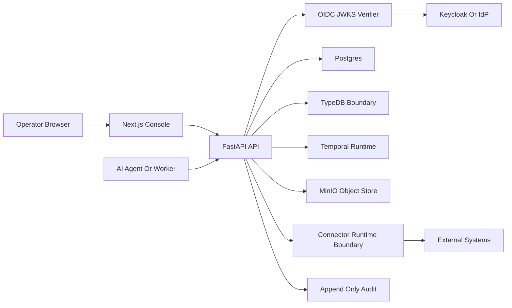

# Limes Axis Threat Model

This is the initial repository-grounded threat model for the public Limes Axis
open core. It is not a production certification, penetration test, compliance
attestation or third-party security review. It is a maintained AppSec baseline
for engineering review, enterprise evaluation and future hardening work.

## Executive Summary

The highest-risk themes are cross-tenant access, connector-secret handling,
unsafe external execution, audit evidence integrity and operator confusion
between a local demo profile and production readiness. The current repository
  already includes important controls: OIDC/JWKS token verification,
  authorization-code PKCE session cookies, permission checks, manifest
  lifecycle gates, credential lease records, egress policy preflight evidence,
  append-only audit events, OpenAPI contract checks and API-required web
  consoles. Live connector sync, model routing execution and governed agent
  runs are now shipped capabilities rather than future work, but each is
  fail-closed behind explicit `AXIS_` flags that default off, and principal
  tenant binding is enforced on the connector read/write routes with a
  canonical isolation test matrix (`test_tenant_isolation.py`). The remaining
  enterprise risk is concentrated around production deployment, full SSO
  operations, WORM retention operations, broader connector/provider coverage
  and support runbooks. Use
  [`docs/security-review-checklist.md`](./security-review-checklist.md) to
  apply this model in PR review.

## Scope And Assumptions

In scope:

- `services/api`: FastAPI control API, identity, permissions, connector,
  audit, demo readiness and manufacturing operation surfaces.
- `services/worker`: Temporal workflow runtime port and worker integration.
- `apps/web`: API-required Next.js governance console.
- `infra/docker`: local self-hosted Postgres, TypeDB, Temporal, MinIO and
  Keycloak runtime.
- `infra/helm/limes-axis`: initial Kubernetes/Helm deployment baseline for API
  and web workloads around externally managed dependencies.
- `services/api/Dockerfile` and `apps/web/Dockerfile`: local container image
  build baselines for the API and web console.
- `docs` and root Makefile checks that define demo and security posture.

Out of scope for this initial model:

- Managed Cloud and Enterprise code that may later move to separate repos.
- Customer production environments, customer-specific connectors and private
  deployment secrets.
- Third-party managed model providers, unless explicitly enabled by future
  policy.
- Formal compliance certification, external penetration testing and legal
  review.

Assumptions:

- The public repo is used for local demos, design-partner walkthroughs and
  open-core development.
- Production customer deployment will require additional hardening beyond the
  local Docker Compose stack.
- Current demo records are persisted tenant-scoped bootstrap/reference records,
  not browser-local mock data.
- No customer secrets should be entered into the demo environment.

Open questions that can change risk ranking:

- Which enterprise deployment shape comes first: managed single tenant,
  private cloud or on-prem.
- Whether the first design partners require internet-exposed APIs or VPN-only
  access.
- Which connector families will be allowed to execute against customer systems
  first.

Evidence anchors:

- `docs/architecture.md` documents runtime, identity and permission boundaries.
- `docs/demo-readiness.md` documents demo limitations and enterprise evaluation
  framing.
- `services/api/src/axis_api/main.py` mounts the API routes and OIDC verifier.
- `services/api/scripts/check_demo_environment.py` verifies the local demo
  readiness contract.
- `services/api/scripts/check_deployment_package.py` verifies the initial Helm
  package and public deployment guide contract.
- `services/api/scripts/check_container_images.py` verifies the API/web
  Dockerfile, Makefile and public deployment documentation contract.

## System Model

### Primary Components

- Web console: Next.js governance UI in `apps/web`.
- API: FastAPI service in `services/api`, exposing REST/OpenAPI routes.
- Persistence: Postgres for operational state and audit rows.
- Ontology boundary: TypeDB for future relationship reasoning, with deferred
  query/mutation boundaries by default.
- Workflow boundary: Temporal OSS behind the Axis workflow runtime port.
- Object storage boundary: MinIO/S3-compatible path for governed evidence.
- Identity boundary: Keycloak/OIDC local direction with JWKS verification.
- Connector boundary: manifest, configuration, credential handle, credential
  lease, egress policy and execution-preflight surfaces.

### Diagram

## Assets

| Asset | Why It Matters | Security Objective |
| --- | --- | --- |
| Tenant-scoped operational records | Drive demo and future customer workflows | Confidentiality, integrity |
| OIDC bearer tokens, HTTP-only session cookies and actor scopes | Bind API actions to actors and tenants | Confidentiality, integrity |
| Connector credential handles and connector credential leases | Reference external secrets without returning raw material | Confidentiality, integrity |
| Append-only audit events and evidence exports | Support governance review and incident analysis | Integrity, availability |
| Workflow run state and Temporal signals | Coordinate approvals and agent/action boundaries | Integrity, availability |
| TypeDB ontology graph and relationship scopes | Control relationship-aware reads and actions | Confidentiality, integrity |
| MinIO/object-store artifacts | Store retained evidence bundles through local or S3-compatible adapters | Integrity, availability |
| OpenAPI contract | Defines public API surface and regression gate | Integrity |
| Model routing policy and external model egress setting | Prevent unapproved external data disclosure | Confidentiality |

## Trust Boundaries

- Browser to API: HTTP requests from `apps/web` to FastAPI cross an origin and
  bearer-token boundary. CORS allows local demo origins and no-store headers;
  protected mutations bind OIDC principals when present or required. Every
  cookie-authenticated state-changing request additionally crosses the
  `BrowserSessionCsrfMiddleware` double-submit boundary; bearer-token and
  safe-method requests are exempt.
- API to identity provider: `/identity/oidc/readiness`,
  `/identity/oidc/onboarding`, `/identity/oidc/authorize`,
  `/identity/oidc/callback`, `/identity/session/refresh` and the verifier
  boundary use OIDC issuer, audience, algorithms, JWKS and authorization-code
  settings. Browser SSO also requires `openid` scope and validates the signed
  provider `id_token`, expiry, client audience, authorized party when present,
  login nonce and cross-token subject binding before minting the Axis session
  cookie. Server-side refresh reuses the configured token endpoint only, stores
  refresh tokens exclusively as AES-GCM ciphertext under an operator key,
  rotates the Axis session id on every refresh and revokes the session when the
  provider rejects the grant. The readiness and IdP onboarding reports are
  public-safe and do not return tokens, passwords or raw JWKS.
- API to Postgres: repository writes persist approvals, action runs, audit
  events, connector records and manufacturing operation records. Idempotency and
  schema validation protect many write paths.
- API to TypeDB: ontology queries and mutations are behind explicit runtime
  flags and adapters. Deferred boundaries are used unless enabled.
- API to Temporal: workflow signal paths use the Axis workflow runtime port and
  can degrade explicitly when the runtime is unavailable.
- API to MinIO/object store: governed evidence materialization writes
  public-safe export artifacts through the configured local or S3-compatible
  adapter. The S3-compatible profile requires object lock and retention days
  before the deployment readiness gate clears. For COMPLIANCE retention the
  platform verifies the bucket object-lock configuration at bootstrap and fails
  closed on audit export if the bucket was not created with object-lock enabled,
  preventing a silent no-op that would falsely claim WORM protection (tampering
  / repudiation mitigation). Object-store legal holds on export artifacts and
  DB-level legal holds on ledger rows are separately audited layers guarding
  against premature deletion.
- API to connector runtime: connector manifests, configurations, credential
  handles, connector credential leases, egress policies, checkpoint claims and
  live-query preflight evidence gate any external movement.
- API/model router to providers: external model egress is disabled by default
  and must be explicitly configured.

## Entry Points

| Surface | How Reached | Trust Boundary | Notes | Evidence |
| --- | --- | --- | --- | --- |
| `/health`, `/ready` | HTTP GET | unauthenticated system status | `/ready` includes OIDC readiness summary | `services/api/src/axis_api/main.py` |
| `/identity/oidc/readiness` | HTTP GET | public-safe identity posture | No token/JWKS secret disclosure | `services/api/tests/test_health.py` |
| `/identity/oidc/onboarding` | HTTP GET | public-safe IdP onboarding metadata | Exact redirect URIs and claim mappings without token material | `services/api/tests/test_health.py` |
| `/identity/oidc/authorize`, `/identity/oidc/callback` | HTTP GET | browser to OIDC provider and API callback | PKCE, state cookie, ID-token expiry/audience/nonce/subject binding and HTTP-only session cookie boundary | `services/api/tests/test_oidc_authorization_code_session.py` |
| `/identity/oidc/logout` | HTTP GET | API to OIDC provider logout redirect | Server-side session revocation plus federated redirect without provider token storage | `services/api/tests/test_oidc_authorization_code_session.py` |
| `/identity/session/logout` | HTTP POST | browser to API session boundary | Local server-side session revocation without IdP redirect; CSRF header required for cookie callers | `services/api/tests/test_oidc_authorization_code_session.py` |
| `/identity/session/refresh` | HTTP POST | browser to API and API to OIDC token endpoint | CSRF-gated rotating refresh: session id and encrypted refresh credential rotate, absolute lifetime capped, provider rejection revokes the session | `services/api/tests/test_oidc_session_lifecycle.py` |
| `/identity/sessions`, `/identity/sessions/{session_ref}/revoke` | HTTP GET/POST | actor to API session inventory | Tenant-isolated opaque session references with cursor pagination; device metadata (bounded user agent, client IP, derived label) visible to the owner/admin listing only; self service plus `identity:sessions:admin` for tenant-wide listing/revocation; CSRF header for cookie callers | `services/api/tests/test_oidc_session_lifecycle.py`, `services/api/tests/test_identity_session_metadata.py` |
| `/deployment/readiness` | HTTP GET | public-safe deployment posture | Reports production blockers, including OIDC secure-session, network egress and DR procedure posture, without secrets | `services/api/tests/test_deployment_readiness.py` |
| `/support/diagnostics` | HTTP GET | public-safe support posture | Reports support blockers, commitment gates and runbook links without sensitive runtime material | `services/api/tests/test_support_diagnostics.py` |
| `/demo/manufacturing/operations/snapshot` | HTTP GET | API to persisted demo state | Drives overview cockpit | `docs/demo-readiness.md` |
| `/demo/manufacturing/approvals` mutation paths | HTTP POST | user/agent to API | OIDC actor binding and permission checks | `services/api/tests/test_approval_decisions.py` |
| `/demo/manufacturing/actions` mutation paths | HTTP POST | agent proposal to API | Typed schemas, idempotency, permission checks | `services/api/tests/test_action_runs.py` |
| `/demo/manufacturing/connectors` paths | HTTP GET/POST | operator to connector boundary | Manifest, config, lease and egress policy gates | `docs/platform-connectors.md` |
| `/demo/manufacturing/audit` paths | HTTP GET/POST | operator to audit ledger | OIDC-bound audit read/export/admin controls, retention deletion and legal holds | `services/api/tests/test_audit_queries.py` |
| `/demo/manufacturing/ontology` read paths | HTTP GET | user/agent to ontology graph boundary | OIDC-bound relationship-scope enforcement at the query/service boundary with denial audit evidence | `services/api/tests/test_ontology_authorization.py` |
| Web console routes | Browser navigation | browser to API | API-required, no local fallback records | `apps/web/e2e/smoke.spec.ts` |
| Makefile/scripts | Local operator CLI | developer/operator machine | Demo and posture checks | `Makefile` |

## Attacker Model

### Capabilities

- Remote unauthenticated user can reach public GET routes if the API is exposed.
- Authenticated tenant user may try to over-read other tenants or impersonate
  higher-privilege actors.
- Malicious operator may attempt to enter raw connector secrets, DSNs or unsafe
  SQL/query material into connector surfaces.
- Compromised agent or workflow path may try to trigger unapproved actions or
  external egress.
- Insider with repository access may accidentally weaken demo or security
  posture documentation unless checked by tests.

### Non-Capabilities

- The attacker is not assumed to control the host filesystem or Docker daemon.
- The attacker is not assumed to possess customer production credentials.
- The attacker cannot execute live source-system connector access while the
  connector execution flags hold their `false` defaults
  (`AXIS_CONNECTOR_SYNC_EXECUTION_ENABLED`,
  `AXIS_CONNECTOR_LIVE_SYNC_EXECUTION_ENABLED`,
  `AXIS_CONNECTOR_SCHEDULED_LIVE_SYNC_ENABLED` and the external-DB live-query
  flags); connector writes to source systems are not implemented at all.
- The attacker cannot trigger model invocations or agent runs while
  `AXIS_MODEL_ROUTING_EXECUTION_ENABLED=false` and
  `AXIS_AGENT_RUN_EXECUTION_ENABLED=false` hold; those paths record honest
  deferred statuses instead of executing.
- The attacker cannot force external model provider egress while the default
  `AXIS_EXTERNAL_MODEL_EGRESS_ENABLED=false` boundary holds.

## Threats And Abuse Paths

1. TM-001 cross-tenant read or write: attacker obtains a token or request body
   for one tenant, changes tenant or actor fields, and attempts to access
   another tenant's operational state.
2. TM-002 connector secret exposure: attacker submits raw secrets, DSNs or query
   strings through connector forms and later reads them through API, logs or
   export evidence.
3. TM-003 unsafe external connector execution: attacker bypasses manifest,
   credential lease, egress policy or checkpoint-claim gates to start live
   source-system access.
4. TM-004 audit evidence tampering: attacker deletes or rewrites audit/export
   evidence to hide approvals, connector activity or policy failures.
5. TM-005 external model egress leak: attacker routes operational context to an
   external provider without explicit tenant policy.
6. TM-006 production-readiness confusion: operator presents local demo controls
   as production DR, customer bucket/KMS approval, enterprise SSO or support
   readiness.

| Threat ID | Threat Source | Prerequisites | Threat Action | Impact | Impacted Assets | Existing Controls | Gaps | Recommended Mitigations | Detection Ideas | Likelihood | Impact Severity | Priority |
| --- | --- | --- | --- | --- | --- | --- | --- | --- | --- | --- | --- | --- |
| TM-001 | Authenticated tenant user | Token or request path reaches protected API | Tenant or actor impersonation | Cross-tenant data exposure or unauthorized mutation | Operational records, approvals, audit | OIDC actor binding and tenant mismatch rejection in `main.py`; principal tenant binding enforced on connector read/write routes; canonical table-driven isolation matrix in `test_tenant_isolation.py` plus per-surface tests in `test_approval_decisions.py`, `test_action_runs.py` | OIDC auth optional in local demo | Require OIDC in non-dev profiles, extend the isolation matrix with every new tenant-scoped surface in the same PR | Alert on 403 tenant mismatch and actor mismatch spikes | Medium | High | High |
| TM-002 | Malicious operator | Connector input accepted by API | Submit raw secret/DSN/query material | Credential disclosure in storage, logs or exports | Credential handles, connector records, audit | Secret rejection tests in connector modules; credential lease evidence boundary | Future provider adapters may add new secret shapes | Centralize redaction schema, add fuzz cases for DSN/token patterns, keep exports public-safe | Audit unsafe-input rejection counts | Medium | High | High |
| TM-003 | Compromised agent or operator | Runtime flags or connector execution enabled | Trigger live query or sync without all gates | External system access or data exfiltration | Source systems, connector leases, audit | Live sync and live query are shipped but fail-closed behind explicit flags (off by default) and require `active_live` manifests, lease-scoped secret resolution, persisted egress policy evidence, runtime egress enforcement, worker checkpoint claims and public-safe evidence gates | Broader provider adapter coverage; flag enablement is an operator decision without a dedicated approval workflow yet | Keep defaults off, require policy bundles and worker claims for every new provider adapter, audit-alert on flag enablement | Alert on preflight failures and runtime flag changes | Low | High | Medium |
| TM-004 | Privileged insider or compromised API path | Access to audit/retention APIs or storage | Delete or rewrite audit evidence | Governance evidence loss | Append-only audit, MinIO artifacts | OIDC-bound audit read/export/admin routes, audit legal holds, retention checks, checksum/signature proof, append-only rows, S3-compatible retention adapter | Provider-specific KMS signing, restore drills and legal operations not production complete | Add KMS signing, restore drills, customer bucket-policy review and legal hold admin UI | Monitor retention deletion requests, tenant mismatch denials and checksum mismatches | Medium | High | High |
| TM-005 | Agent or route operator | External egress enabled incorrectly | Send operations context to external model | Data leakage and compliance breach | Operational records, model routing telemetry | Model routing execution and governed agent runs ship behind `AXIS_MODEL_ROUTING_EXECUTION_ENABLED` / `AXIS_AGENT_RUN_EXECUTION_ENABLED` (off by default); external egress separately gated by `AXIS_EXTERNAL_MODEL_EGRESS_ENABLED=false`; endpoints declare hosting boundaries; invocations persist metadata-only records (prompt excerpt length defaults to 0) with audit evidence and usage metering | Only the openai-compatible provider adapter exists; no per-tenant egress exception workflow yet | Enforce tenant policy approval for non-self-hosted boundaries, classify prompts, keep prompt excerpts disabled by default | Alert on external egress enablement and route decisions | Low | High | Medium |
| TM-006 | Operator or sales workflow | Demo limitations not shared | Overclaim readiness | Customer trust and compliance risk | Security posture, contracts, operations | `docs/demo-readiness.md`, `docs/backup-restore.md`, `docs/support-operations.md`, `/identity/oidc/readiness`, `/deployment/readiness`, `/support/diagnostics` | Full production runbook execution still depends on customer environment | Add production DR, support, SSO, KMS and customer bucket operations runbooks; require pre-demo checklist | Track demo readiness, deployment readiness, support diagnostics and security-check output per walkthrough | Medium | Medium | Medium |

## Existing Controls

- Identity: OIDC/JWKS verifier, actor/tenant binding, authorization-code PKCE
  callback, ID-token issuer/audience/authorized-party/expiry/nonce validation,
  cross-token subject binding, HTTP-only session cookie validation, persisted
  `oidc_browser_sessions` revocation state, `POST /identity/session/logout`
  audit evidence, public-safe `/identity/oidc/readiness` posture reporting and
  deployment readiness gating for Secure cookies, signing secret presence,
  bounded TTL and HTTPS API/public/redirect URLs. Production session lifecycle
  adds server-side refresh rotation with HKDF-derived AES-GCM-encrypted refresh
  credentials (minimum key length enforced at startup) and an atomic
  `active`->`refreshing` claim that serializes concurrent refreshes so one
  parent cannot mint two child sessions (with lazy recovery that revokes
  claims orphaned by a crash as `refresh_claim_orphaned` after a bounded
  staleness window), idle and absolute timeouts, per-actor
  concurrent-session caps, tenant-isolated session listing and revocation
  (self plus `identity:sessions:admin`), and audit evidence for logins, failed
  code exchanges, refreshes, failed refreshes, revocations and logouts that
  references sessions only by keyed hash. Session rows additionally carry
  device metadata captured at login and refresh (user agent bounded to 256
  characters, client IP and a parsed device label) so operators can review
  their session inventory for anomalies. The client IP is personal data kept
  for security review: it is stored as provided, resolved from
  `X-Forwarded-For` only when
  `AXIS_IDENTITY_SESSION_TRUSTED_PROXY_ENABLED=true` declares a single trusted
  proxy edge - in which case the LAST (rightmost) hop is recorded because a
  standard proxy appends the peer it observed there, while every leftmost
  entry is client-attested and forgeable and is never trusted. With the flag
  off the socket peer is recorded and the header is ignored. The single-proxy
  assumption is a documented limitation: a multi-proxy chain would need a
  configurable trusted-hop count (follow-up, not implemented). The IP is
  exposed only through the owner/admin-scoped session listing, never written
  into audit payloads, and deleted with the session row - it has no
  independent retention. On refresh rotation the device metadata (user agent,
  IP, device label) is re-captured from the refreshing request: this is the
  intended posture. A stolen cookie replayed from another device updates the
  new active session row to the attacker's device fingerprint, but the
  original login's fingerprint is preserved on the superseded `rotated`
  historical row, so forensic history stays intact while the current-session
  view reflects the most recent holder. CSRF is enforced centrally by
  `BrowserSessionCsrfMiddleware` for every cookie-authenticated state-changing
  request across the API (not only the identity endpoints) via an HMAC
  double-submit token, with bearer and safe-method requests exempt, alongside
  `__Host-`-prefixed Secure cookies.
- Permissions: RBAC, ABAC and relationship-aware permission primitives with
  endpoint tests for approvals, actions and ontology reads. Ontology graph and
  entity detail reads enforce OIDC-derived relationship scopes at the
  query/service boundary for both the persisted-reference and TypeDB read
  runtimes, and denied ontology reads append tenant-scoped audit evidence.
- Connector governance: manifest lifecycle gates, active preview requirements,
  credential handles, connector credential leases, egress policy evidence,
  checkpoint claims and deferred execution boundaries.
- Audit: persisted append-only audit rows, OIDC-bound read/export/admin routes,
  export bundles, checksum/hash-chain proof, legal hold and retention deletion
  blocking.
- Model routing and agent runs: model routing execution and governed agent run
  execution are flag-gated and off by default with honest deferred statuses;
  external model egress is separately disabled by default; model invocations
  persist metadata-only records with audit evidence; agent runs produce
  approval-gated action proposals only and fail closed on unparseable or
  unpermitted model output.
- Web: API-required console smoke tests prevent browser-local fallback data.
- Support: public-safe support diagnostics and the support operations runbook
  expose demo support posture, production support-readiness, SLO target checks
  escalation channel classes and support commitment gates without sensitive
  runtime, contract, staffing or contact material.
- Deployment operations: bounded HA restart, load and TLS readiness rehearsal
  plans exercise Kubernetes workload restart, Fortio Job, Ingress,
  cert-manager, DNS and HTTPS reachability paths before production promotion.
- Network egress: Helm supports `port_allowlist`, `restricted` and `offline`
  NetworkPolicy modes, while `/deployment/readiness` blocks production readiness
  until restricted/offline posture is configured.
- Deployment tenancy: `/deployment/readiness` reports
  `deployment_tenancy_profile` for `saas_multi_tenant`,
  `single_tenant_managed`, `private_cloud` and `on_prem` paths, and blocks
  production readiness until isolation, data-residency, operator-access and
  break-glass evidence are configured.
- Disaster recovery: `/deployment/readiness` includes a public-safe
  `production_dr_procedures` gate for approved runbook, RPO/RTO, rehearsal
  evidence, restore owner and customer approval configuration without exposing
  customer-specific procedure details.
- Contracts: OpenAPI generation check, `make demo-check`, `make demo-check-live`
  and `make security-check`.

## Open Risks And Next Hardening Work

- Postgres production backup, isolated Postgres restore, isolated TypeDB
  recovery, bounded object-store recovery and Temporal namespace/history
  evidence rehearsals exist, and `/deployment/readiness` gates public-safe DR
  procedure configuration, but full retention, Temporal persistence restore,
  full-bucket object-store restore and disaster recovery execution are not
  complete.
- Helm/Kubernetes deployment guides, in-process API rate limiting,
  active/staged Secret rotation rehearsal, HA restart rehearsal, bounded load
  rehearsal, TLS readiness rehearsal and local image build baselines exist, but
  sustained customer-profile HA validation under load, customer-specific network
  egress review, automated certificate renewal drills, upstream secret-manager
  rotation, access reviews, image provenance/signing and release automation are
  not complete.
- S3-compatible retention adapter readiness and a bounded object-store recovery
  rehearsal exist, but provider KMS signing, customer bucket-policy review and
  full-bucket restore drills are not production complete.
- Enterprise SSO has an explicit secure browser-session readiness gate,
  `openid` scope gating and ID-token nonce/subject binding, but still needs
  refresh-token rotation and customer-specific production operations runbooks.
- Governed live connector sync, external DB live query, model routing
  execution and agent runs are shipped flag-gated capabilities (off by
  default). Residual risk is operational: enabling the flags is an operator
  decision, provider adapter coverage is narrow (file/CSV dropzone,
  allowlisted Postgres profiles, openai-compatible model endpoints), and
  per-tenant enablement/approval workflows for flag changes are not built yet.
- In-process API rate limiting exists for public and sensitive routes, but
  global abuse throttling, production telemetry alerting and incident response
  are not complete controls.
- Production support-readiness checks now include signed-commitment, named
  staffing, customer incident operations and legal SLA term gates, but actual
  agreements, personal staffing assignments and legal documents remain outside
  the open repository baseline.
- This threat model is not a production certification.

## Focus Paths For Security Review

| Path | Why It Matters | Related Threat IDs |
| --- | --- | --- |
| `services/api/src/axis_api/main.py` | Route mounting, OIDC principal/session binding, logout and runtime selection | TM-001, TM-003, TM-005 |
| `services/api/src/axis_api/identity.py` | Token parsing, JWKS validation and actor/tenant extraction | TM-001 |
| `services/api/src/axis_api/oidc_code_flow.py` | Authorization-code PKCE, state cookie, token exchange, session-id hashing and signed session cookie boundary | TM-001, TM-006 |
| `services/api/src/axis_api/connector_*` | Connector manifest, credential, lease, policy and execution gates | TM-002, TM-003 |
| `services/api/src/axis_api/audit_queries.py` | Audit export, legal hold and retention deletion controls | TM-004 |
| `services/api/src/axis_api/model_endpoints.py`, `model_invocations.py`, `model_providers.py` | Model endpoint registration, hosting-boundary/egress gating and governed invocation runtime | TM-005 |
| `services/api/src/axis_api/agent_runs.py` | Governed agent run execution, autonomy ceilings and proposal gating | TM-003, TM-005 |
| `services/api/tests/test_tenant_isolation.py` | Canonical cross-tenant isolation matrix across the API surface | TM-001 |
| `apps/web/e2e/smoke.spec.ts` | Guards API-required UI behavior and prevents fallback data | TM-006 |
| `infra/docker/docker-compose.yml` | Local runtime topology and exposed service ports | TM-006 |
| `infra/helm/limes-axis` | Kubernetes deployment baseline, tenancy profile readiness env, TLS Ingress routing, cert-manager ingress-shim annotation support, HPA/PDB availability controls, scheduling/topology controls, rollout strategy and termination controls, Helm smoke tests, rollout rehearsal runbook, HA restart rehearsal, load rehearsal, TLS readiness rehearsal, production backup, Postgres restore, TypeDB recovery, object-store recovery, Temporal namespace/history evidence and active/staged Secret rotation rehearsals, external dependency wiring, ExternalSecret synchronization and secret references | TM-006 |
| `services/api/Dockerfile`, `apps/web/Dockerfile` | Local API/web image build baselines and runtime boundaries | TM-006 |
| `docs/demo-readiness.md` | Demo limitations and enterprise evaluation framing | TM-006 |
| `docs/backup-restore.md` | Local demo backup boundary and non-production DR warning | TM-006 |
| `docs/deployment.md` | Helm baseline, external Postgres/TypeDB/Temporal/OIDC/object-store dependencies, deployment tenancy profiles, TypeDB, object-store, Temporal, Secret rotation, HA restart, load and TLS readiness rehearsals and production hardening gates | TM-006 |

## Review Cadence

- Run `make security-check` before PRs that change identity, permissions,
  connectors, audit, model routing, deployment, backup/restore or demo claims,
  and walk [`docs/security-review-checklist.md`](./security-review-checklist.md)
  for the sections the PR touches.
- Run `make deployment-check` before PRs that change `infra/helm/limes-axis`,
  production deployment docs or Kubernetes readiness claims.
- Review this document after each merged enterprise hardening slice.
- Re-run the threat model before connecting customer production systems,
  enabling live connector execution or claiming production deployment readiness.
