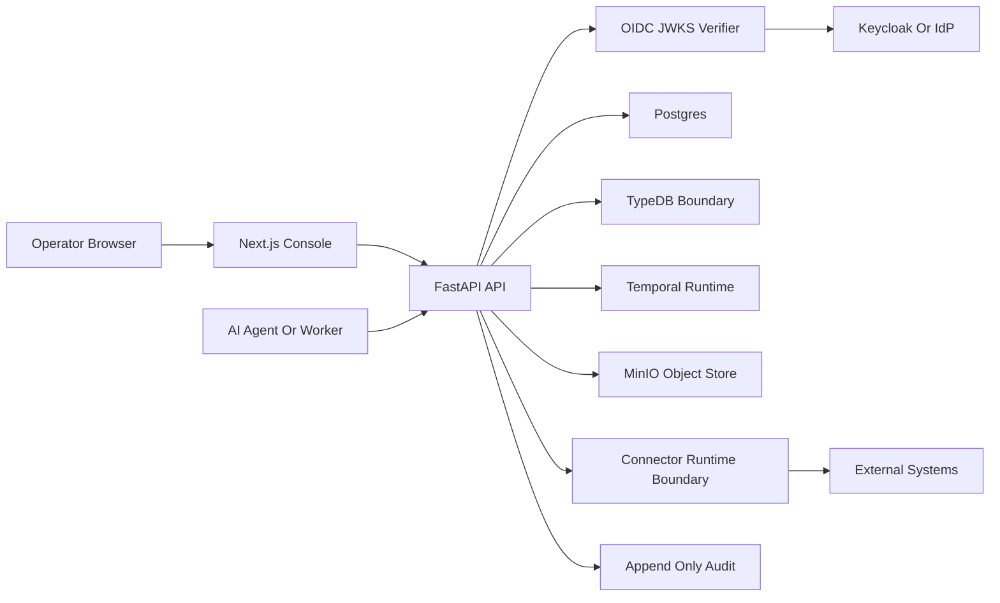

# Limes Axis Threat Model

This is the initial repository-grounded threat model for the public Limes Axis
open core. It is not a production certification, penetration test, compliance
attestation or third-party security review. It is a maintained AppSec baseline
for engineering review, enterprise evaluation and future hardening work.

## Executive Summary

The highest-risk themes are cross-tenant access, connector-secret handling,
unsafe external execution, audit evidence integrity and operator confusion
between a local demo profile and production readiness. The current repository
already includes important controls: OIDC/JWKS token verification, permission
checks, manifest lifecycle gates, credential lease records, egress policy
preflight evidence, append-only audit events, OpenAPI contract checks and
API-required web consoles. The remaining enterprise risk is concentrated around
production deployment, full SSO operations, WORM retention, live connector
execution and support runbooks.

## Scope And Assumptions

In scope:

- `services/api`: FastAPI control API, identity, permissions, connector,
  audit, demo readiness and manufacturing operation surfaces.
- `services/worker`: Temporal workflow runtime port and worker integration.
- `apps/web`: API-required Next.js governance console.
- `infra/docker`: local self-hosted Postgres, TypeDB, Temporal, MinIO and
  Keycloak runtime.
- `infra/helm/limes-axis`: initial Kubernetes/Helm deployment baseline for API
  and web workloads around externally managed dependencies.
- `services/api/Dockerfile` and `apps/web/Dockerfile`: local container image
  build baselines for the API and web console.
- `docs` and root Makefile checks that define demo and security posture.

Out of scope for this initial model:

- Managed Cloud and Enterprise code that may later move to separate repos.
- Customer production environments, customer-specific connectors and private
  deployment secrets.
- Third-party managed model providers, unless explicitly enabled by future
  policy.
- Formal compliance certification, external penetration testing and legal
  review.

Assumptions:

- The public repo is used for local demos, design-partner walkthroughs and
  open-core development.
- Production customer deployment will require additional hardening beyond the
  local Docker Compose stack.
- Current demo records are persisted tenant-scoped bootstrap/reference records,
  not browser-local mock data.
- No customer secrets should be entered into the demo environment.

Open questions that can change risk ranking:

- Which enterprise deployment shape comes first: managed single tenant,
  private cloud or on-prem.
- Whether the first design partners require internet-exposed APIs or VPN-only
  access.
- Which connector families will be allowed to execute against customer systems
  first.

Evidence anchors:

- `docs/architecture.md` documents runtime, identity and permission boundaries.
- `docs/demo-readiness.md` documents demo limitations and enterprise evaluation
  framing.
- `services/api/src/axis_api/main.py` mounts the API routes and OIDC verifier.
- `services/api/scripts/check_demo_environment.py` verifies the local demo
  readiness contract.
- `services/api/scripts/check_deployment_package.py` verifies the initial Helm
  package and public deployment guide contract.
- `services/api/scripts/check_container_images.py` verifies the API/web
  Dockerfile, Makefile and public deployment documentation contract.

## System Model

### Primary Components

- Web console: Next.js governance UI in `apps/web`.
- API: FastAPI service in `services/api`, exposing REST/OpenAPI routes.
- Persistence: Postgres for operational state and audit rows.
- Ontology boundary: TypeDB for future relationship reasoning, with deferred
  query/mutation boundaries by default.
- Workflow boundary: Temporal OSS behind the Axis workflow runtime port.
- Object storage boundary: MinIO/S3-compatible path for governed evidence.
- Identity boundary: Keycloak/OIDC local direction with JWKS verification.
- Connector boundary: manifest, configuration, credential handle, credential
  lease, egress policy and execution-preflight surfaces.

### Diagram

## Assets

| Asset | Why It Matters | Security Objective |
| --- | --- | --- |
| Tenant-scoped operational records | Drive demo and future customer workflows | Confidentiality, integrity |
| OIDC bearer tokens and actor scopes | Bind API actions to actors and tenants | Confidentiality, integrity |
| Connector credential handles and connector credential leases | Reference external secrets without returning raw material | Confidentiality, integrity |
| Append-only audit events and evidence exports | Support governance review and incident analysis | Integrity, availability |
| Workflow run state and Temporal signals | Coordinate approvals and agent/action boundaries | Integrity, availability |
| TypeDB ontology graph and relationship scopes | Control relationship-aware reads and actions | Confidentiality, integrity |
| MinIO/object-store artifacts | Store retained evidence bundles through local or S3-compatible adapters | Integrity, availability |
| OpenAPI contract | Defines public API surface and regression gate | Integrity |
| Model routing policy and external model egress setting | Prevent unapproved external data disclosure | Confidentiality |

## Trust Boundaries

- Browser to API: HTTP requests from `apps/web` to FastAPI cross an origin and
  bearer-token boundary. CORS allows local demo origins and no-store headers;
  protected mutations bind OIDC principals when present or required.
- API to identity provider: `/identity/oidc/readiness` and the verifier boundary
  use OIDC issuer, audience, algorithms and JWKS configuration. The readiness
  report is public-safe and does not return tokens, passwords or raw JWKS.
- API to Postgres: repository writes persist approvals, action runs, audit
  events, connector records and manufacturing operation records. Idempotency and
  schema validation protect many write paths.
- API to TypeDB: ontology queries and mutations are behind explicit runtime
  flags and adapters. Deferred boundaries are used unless enabled.
- API to Temporal: workflow signal paths use the Axis workflow runtime port and
  can degrade explicitly when the runtime is unavailable.
- API to MinIO/object store: governed evidence materialization writes
  public-safe export artifacts through the configured local or S3-compatible
  adapter. The S3-compatible profile requires object lock and retention days
  before the deployment readiness gate clears.
- API to connector runtime: connector manifests, configurations, credential
  handles, connector credential leases, egress policies, checkpoint claims and
  live-query preflight evidence gate any external movement.
- API/model router to providers: external model egress is disabled by default
  and must be explicitly configured.

## Entry Points

| Surface | How Reached | Trust Boundary | Notes | Evidence |
| --- | --- | --- | --- | --- |
| `/health`, `/ready` | HTTP GET | unauthenticated system status | `/ready` includes OIDC readiness summary | `services/api/src/axis_api/main.py` |
| `/identity/oidc/readiness` | HTTP GET | public-safe identity posture | No token/JWKS secret disclosure | `services/api/tests/test_health.py` |
| `/deployment/readiness` | HTTP GET | public-safe deployment posture | Reports production blockers without secrets | `services/api/tests/test_deployment_readiness.py` |
| `/support/diagnostics` | HTTP GET | public-safe support posture | Reports support blockers and runbook links without sensitive runtime material | `services/api/tests/test_support_diagnostics.py` |
| `/demo/manufacturing/operations/snapshot` | HTTP GET | API to persisted demo state | Drives overview cockpit | `docs/demo-readiness.md` |
| `/demo/manufacturing/approvals` mutation paths | HTTP POST | user/agent to API | OIDC actor binding and permission checks | `services/api/tests/test_approval_decisions.py` |
| `/demo/manufacturing/actions` mutation paths | HTTP POST | agent proposal to API | Typed schemas, idempotency, permission checks | `services/api/tests/test_action_runs.py` |
| `/demo/manufacturing/connectors` paths | HTTP GET/POST | operator to connector boundary | Manifest, config, lease and egress policy gates | `docs/platform-connectors.md` |
| `/demo/manufacturing/audit` paths | HTTP GET/POST | operator to audit ledger | Export, retention and legal hold controls | `docs/platform-audit.md` |
| Web console routes | Browser navigation | browser to API | API-required, no local fallback records | `apps/web/e2e/smoke.spec.ts` |
| Makefile/scripts | Local operator CLI | developer/operator machine | Demo and posture checks | `Makefile` |

## Attacker Model

### Capabilities

- Remote unauthenticated user can reach public GET routes if the API is exposed.
- Authenticated tenant user may try to over-read other tenants or impersonate
  higher-privilege actors.
- Malicious operator may attempt to enter raw connector secrets, DSNs or unsafe
  SQL/query material into connector surfaces.
- Compromised agent or workflow path may try to trigger unapproved actions or
  external egress.
- Insider with repository access may accidentally weaken demo or security
  posture documentation unless checked by tests.

### Non-Capabilities

- The attacker is not assumed to control the host filesystem or Docker daemon.
- The attacker is not assumed to possess customer production credentials.
- The attacker cannot execute live source-system connector writes unless future
  deployment explicitly enables guarded runtime paths.
- The attacker cannot force external model provider egress while the default
  `AXIS_EXTERNAL_MODEL_EGRESS_ENABLED=false` boundary holds.

## Threats And Abuse Paths

1. TM-001 cross-tenant read or write: attacker obtains a token or request body
   for one tenant, changes tenant or actor fields, and attempts to access
   another tenant's operational state.
2. TM-002 connector secret exposure: attacker submits raw secrets, DSNs or query
   strings through connector forms and later reads them through API, logs or
   export evidence.
3. TM-003 unsafe external connector execution: attacker bypasses manifest,
   credential lease, egress policy or checkpoint-claim gates to start live
   source-system access.
4. TM-004 audit evidence tampering: attacker deletes or rewrites audit/export
   evidence to hide approvals, connector activity or policy failures.
5. TM-005 external model egress leak: attacker routes operational context to an
   external provider without explicit tenant policy.
6. TM-006 production-readiness confusion: operator presents local demo controls
   as production DR, customer bucket/KMS approval, enterprise SSO or support
   readiness.

| Threat ID | Threat Source | Prerequisites | Threat Action | Impact | Impacted Assets | Existing Controls | Gaps | Recommended Mitigations | Detection Ideas | Likelihood | Impact Severity | Priority |
| --- | --- | --- | --- | --- | --- | --- | --- | --- | --- | --- | --- | --- |
| TM-001 | Authenticated tenant user | Token or request path reaches protected API | Tenant or actor impersonation | Cross-tenant data exposure or unauthorized mutation | Operational records, approvals, audit | OIDC actor binding and tenant mismatch rejection in `main.py`; tests in `test_approval_decisions.py`, `test_action_runs.py` | OIDC auth optional in local demo | Require OIDC in non-dev profiles, add tenant-scoped query checks everywhere, add integration tests for every mutation | Alert on 403 tenant mismatch and actor mismatch spikes | Medium | High | High |
| TM-002 | Malicious operator | Connector input accepted by API | Submit raw secret/DSN/query material | Credential disclosure in storage, logs or exports | Credential handles, connector records, audit | Secret rejection tests in connector modules; credential lease evidence boundary | Future provider adapters may add new secret shapes | Centralize redaction schema, add fuzz cases for DSN/token patterns, keep exports public-safe | Audit unsafe-input rejection counts | Medium | High | High |
| TM-003 | Compromised agent or operator | Runtime flags or connector execution enabled | Trigger live query or sync without all gates | External system access or data exfiltration | Source systems, connector leases, audit | Active manifest, lease, egress policy, checkpoint claim and public-safe evidence gates | Full live execution path remains future work | Keep default deferred, require policy bundles and worker claims for every provider adapter | Alert on preflight failures and runtime flag changes | Low | High | Medium |
| TM-004 | Privileged insider or compromised API path | Access to audit/retention APIs or storage | Delete or rewrite audit evidence | Governance evidence loss | Append-only audit, MinIO artifacts | Audit legal holds, retention checks, checksum/signature proof, append-only rows, S3-compatible retention adapter | Provider-specific KMS signing, restore drills and legal operations not production complete | Add KMS signing, restore drills, customer bucket-policy review and legal hold admin UI | Monitor retention deletion requests and checksum mismatches | Medium | High | High |
| TM-005 | Agent or route operator | External egress enabled incorrectly | Send operations context to external model | Data leakage and compliance breach | Operational records, model routing telemetry | External model egress disabled by default, route metadata public-safe | Provider adapters and usage metering not complete | Enforce tenant policy approval, classify prompts, log route decisions to audit | Alert on external egress enablement and route decisions | Low | High | Medium |
| TM-006 | Operator or sales workflow | Demo limitations not shared | Overclaim readiness | Customer trust and compliance risk | Security posture, contracts, operations | `docs/demo-readiness.md`, `docs/backup-restore.md`, `docs/support-operations.md`, `/identity/oidc/readiness`, `/deployment/readiness`, `/support/diagnostics` | Production runbooks still open | Add production DR, support, SSO, KMS and customer bucket operations runbooks; require pre-demo checklist | Track demo readiness, deployment readiness, support diagnostics and security-check output per walkthrough | Medium | Medium | Medium |

## Existing Controls

- Identity: OIDC/JWKS verifier, actor/tenant binding and public-safe
  `/identity/oidc/readiness` posture reporting.
- Permissions: RBAC, ABAC and relationship-aware permission primitives with
  endpoint tests for approvals, actions and ontology reads.
- Connector governance: manifest lifecycle gates, active preview requirements,
  credential handles, connector credential leases, egress policy evidence,
  checkpoint claims and deferred execution boundaries.
- Audit: persisted append-only audit rows, export bundles, checksum/hash-chain
  proof, legal hold and retention deletion blocking.
- Model routing: external model egress disabled by default.
- Web: API-required console smoke tests prevent browser-local fallback data.
- Support: public-safe support diagnostics and the support operations baseline
  runbook expose demo support posture without sensitive runtime material.
- Contracts: OpenAPI generation check, `make demo-check`, `make demo-check-live`
  and `make security-check`.

## Open Risks And Next Hardening Work

- A Postgres production backup rehearsal exists, but isolated restore drills,
  full retention and disaster recovery are not complete.
- Helm/Kubernetes deployment guides and local image build baselines exist, but
  HA runbooks, image provenance/signing and release automation are not complete.
- S3-compatible retention adapter readiness exists, but provider KMS signing,
  customer bucket-policy review and restore drills are not production complete.
- Enterprise SSO still needs authorization-code login, refresh handling,
  secure-cookie sessions, IdP onboarding and operations runbooks.
- Live connector execution against customer systems remains future guarded work.
- Rate limiting, abuse throttling and production telemetry alerting are not yet
  described as complete controls.
- This threat model is not a production certification.

## Focus Paths For Security Review

| Path | Why It Matters | Related Threat IDs |
| --- | --- | --- |
| `services/api/src/axis_api/main.py` | Route mounting, OIDC principal binding and runtime selection | TM-001, TM-003, TM-005 |
| `services/api/src/axis_api/identity.py` | Token parsing, JWKS validation and actor/tenant extraction | TM-001 |
| `services/api/src/axis_api/connector_*` | Connector manifest, credential, lease, policy and execution gates | TM-002, TM-003 |
| `services/api/src/axis_api/audit_queries.py` | Audit export, legal hold and retention deletion controls | TM-004 |
| `services/api/src/axis_api/model_routing.py` | Model egress policy and route metadata | TM-005 |
| `apps/web/e2e/smoke.spec.ts` | Guards API-required UI behavior and prevents fallback data | TM-006 |
| `infra/docker/docker-compose.yml` | Local runtime topology and exposed service ports | TM-006 |
| `infra/helm/limes-axis` | Kubernetes deployment baseline, TLS Ingress routing, cert-manager ingress-shim annotation support, HPA/PDB availability controls, scheduling/topology controls, rollout strategy and termination controls, Helm smoke tests, rollout rehearsal runbook, production backup rehearsal, external dependency wiring, ExternalSecret synchronization and secret references | TM-006 |
| `services/api/Dockerfile`, `apps/web/Dockerfile` | Local API/web image build baselines and runtime boundaries | TM-006 |
| `docs/demo-readiness.md` | Demo limitations and enterprise evaluation framing | TM-006 |
| `docs/backup-restore.md` | Local demo backup boundary and non-production DR warning | TM-006 |
| `docs/deployment.md` | Helm baseline, external Postgres/OIDC/object-store dependencies and production hardening gates | TM-006 |

## Review Cadence

- Run `make security-check` before PRs that change identity, permissions,
  connectors, audit, model routing, deployment, backup/restore or demo claims.
- Run `make deployment-check` before PRs that change `infra/helm/limes-axis`,
  production deployment docs or Kubernetes readiness claims.
- Review this document after each merged enterprise hardening slice.
- Re-run the threat model before connecting customer production systems,
  enabling live connector execution or claiming production deployment readiness.
